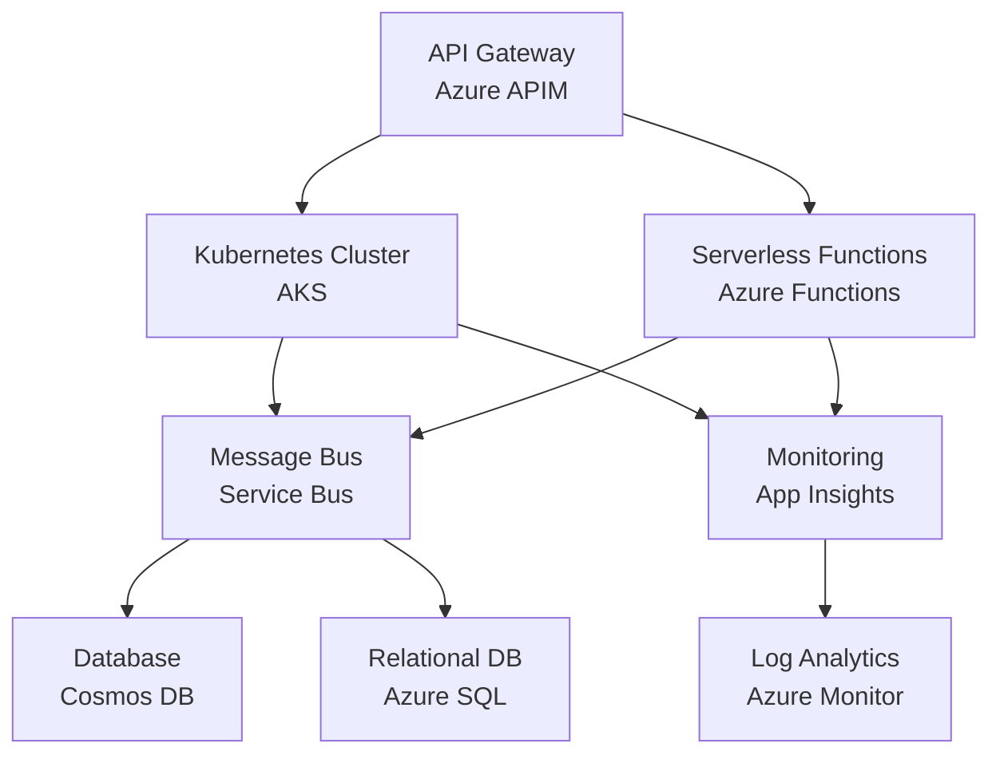

# Microservices Interview Notes

## Azure Cloud FullStack Developer Interview Preparation Guide

---

## Introduction

Welcome to the comprehensive Microservices interview preparation guide specifically designed for **Azure Cloud FullStack Developer** positions. This document provides in-depth coverage of microservices architecture patterns, Azure-specific implementations, and production-ready code examples that demonstrate expertise in building scalable, resilient distributed systems on the Microsoft Azure platform.

### Why Microservices Matter for Azure Cloud FullStack Developers

Microservices architecture has become the cornerstone of modern cloud-native application development, especially in Azure environments. As an Azure Cloud FullStack Developer, understanding microservices is crucial because:

- **Azure-Native Services**: Deep integration with Azure Kubernetes Service (AKS), Service Fabric, Azure Functions, and Azure Service Bus
- **Scalability Requirements**: Enterprise applications demand horizontal scaling and independent service deployments
- **DevOps Integration**: Seamless CI/CD pipelines with Azure DevOps and containerization strategies
- **Business Agility**: Faster time-to-market through independent team ownership and technology diversity
- **Resilience & Reliability**: Built-in fault tolerance and disaster recovery capabilities in Azure

### Key Focus Areas for Interview Success

This guide covers the essential topics that Azure Cloud FullStack Developer interviews typically emphasize:

#### 1. **Architectural Foundations**

- **Microservices vs Monolithic Architecture**: Trade-offs, migration strategies, and when to choose each approach
- **Service Decomposition Strategies**: Domain-driven design, bounded contexts, and data ownership principles
- **Azure Service Integration**: Leveraging Azure's managed services for microservices infrastructure

#### 2. **Communication Patterns & Integration**

- **Synchronous Communication**: RESTful APIs, gRPC, and HTTP-based service-to-service communication
- **Asynchronous Messaging**: Azure Service Bus, Event Hubs, and event-driven architectures
- **API Gateway Patterns**: Azure API Management, request routing, and cross-cutting concerns
- **Service Discovery**: Azure-native service discovery mechanisms and DNS-based routing

#### 3. **Data Management & Consistency**

- **Database Per Service**: Data isolation strategies and polyglot persistence
- **Distributed Transactions**: Saga pattern implementation with Azure Service Bus
- **CQRS & Event Sourcing**: Command Query Responsibility Segregation with Azure Cosmos DB
- **Data Synchronization**: Eventual consistency patterns and conflict resolution

#### 4. **Resilience & Fault Tolerance**

- **Circuit Breaker Pattern**: Implementation with Polly library and Azure Application Insights
- **Retry Mechanisms**: Exponential backoff strategies and dead letter queues
- **Bulkhead Isolation**: Resource isolation and failure containment
- **Health Monitoring**: Azure Monitor integration and distributed tracing

#### 5. **Security & Cross-Cutting Concerns**

- **Identity & Access Management**: Azure AD integration, JWT tokens, and OAuth 2.0 flows
- **API Security**: Rate limiting, input validation, and threat protection
- **Service-to-Service Authentication**: Managed identities and certificate-based authentication
- **Data Encryption**: Transit and at-rest encryption strategies

#### 6. **Container Orchestration & Deployment**

- **Docker Containerization**: Multi-stage builds, image optimization, and security scanning
- **Kubernetes on AKS**: Pod management, services, ingress controllers, and scaling strategies
- **Azure Service Fabric**: Stateful and stateless services, reliable collections, and cluster management
- **Serverless Microservices**: Azure Functions and container instances for event-driven architectures

#### 7. **DevOps & Observability**

- **CI/CD Pipelines**: Azure DevOps integration, automated testing, and blue-green deployments
- **Monitoring & Logging**: Application Insights, Azure Monitor, and centralized logging strategies
- **Distributed Tracing**: Correlation IDs, request tracking, and performance monitoring
- **Infrastructure as Code**: ARM templates, Bicep, and Terraform for Azure resource management

#### 8. **Performance & Scalability**

- **Auto-scaling Patterns**: Horizontal Pod Autoscaler, VMSS, and Azure Functions scaling
- **Caching Strategies**: Redis Cache, CDN integration, and distributed caching patterns
- **Load Balancing**: Azure Load Balancer, Application Gateway, and Traffic Manager
- **Performance Optimization**: Memory management, connection pooling, and resource efficiency

#### 9. **Azure-Specific Services Integration**

- **Azure Kubernetes Service (AKS)**: Cluster management, networking, and security configurations
- **Azure Service Bus**: Queues, topics, subscriptions, and message routing
- **Azure Event Hubs**: High-throughput event streaming and real-time analytics
- **Azure Cosmos DB**: Multi-model database, global distribution, and consistency levels
- **Azure Functions**: Serverless compute, triggers, and bindings
- **Azure API Management**: Gateway patterns, policy management, and developer portals

#### 10. **Testing Strategies**

- **Unit Testing**: Microservice-specific testing patterns and mocking strategies
- **Integration Testing**: Contract testing, test containers, and service virtualization
- **End-to-End Testing**: Distributed system testing and chaos engineering
- **Performance Testing**: Load testing with Azure Load Testing and capacity planning

#### 11. **Migration & Legacy Integration**

- **Strangler Fig Pattern**: Gradual migration from monolithic to microservices
- **Anti-Corruption Layer**: Legacy system integration and data transformation
- **Event Storming**: Domain analysis and service boundary identification
- **Incremental Migration**: Risk mitigation and rollback strategies

#### 12. **Business & Organizational Considerations**

- **Conway's Law**: Team structure impact on architecture design
- **Domain-Driven Design**: Bounded contexts, aggregates, and ubiquitous language
- **Team Topologies**: Platform teams, stream-aligned teams, and enabling teams
- **Cost Optimization**: Azure cost management and resource optimization strategies

### Interview Preparation Strategy

To maximize your success in Azure Cloud FullStack Developer interviews focusing on microservices:

#### **Technical Depth Requirements**

- **Code Implementation**: Be prepared to write production-ready C# code using .NET Core/5+
- **Azure Services Knowledge**: Demonstrate hands-on experience with AKS, Service Bus, Cosmos DB, and API Management
- **Architecture Design**: Sketch system diagrams showing service interactions and data flows
- **Problem-Solving**: Explain trade-offs and justify architectural decisions with real-world scenarios

#### **Practical Examples to Master**

- **E-commerce Microservices**: Product catalog, order processing, payment, and inventory services
- **Event-Driven Architecture**: Order saga implementation with compensating transactions
- **Multi-Tenant SaaS**: Tenant isolation strategies and shared infrastructure patterns
- **IoT Data Pipeline**: Real-time event processing with Azure Event Hubs and Stream Analytics

#### **Common Interview Scenarios**

- **System Design Questions**: "Design a scalable e-commerce platform using microservices on Azure"
- **Troubleshooting Scenarios**: "How would you debug a distributed transaction failure?"
- **Performance Optimization**: "A microservice is experiencing high latency - how do you investigate?"
- **Security Challenges**: "Implement secure service-to-service communication in Azure"

### Document Structure & Usage Guide

This interview preparation guide is organized for progressive learning and quick reference:

1. **Introduction** (Current Section): Overview, context, and strategic preparation approach
2. **Core Concepts**: Fundamental microservices principles with Azure-specific implementations
3. **Q&A Section**: Comprehensive interview questions with detailed, production-focused answers
4. **Code Samples**: Real-world, production-ready implementations using C#, .NET, and Azure services
5. **TL;DR Summary**: Quick reference tables, checklists, and key takeaways for last-minute review

Each section builds upon previous concepts while providing standalone value for targeted study. The code examples are production-ready and demonstrate best practices used in enterprise Azure environments.

### Success Metrics for Interview Preparation

By completing this guide, you should be able to:

- ✅ **Articulate** the benefits and challenges of microservices architecture in Azure environments
- ✅ **Design** scalable, resilient microservices systems using Azure managed services
- ✅ **Implement** key patterns like Circuit Breaker, Saga, and CQRS with concrete code examples
- ✅ **Explain** data consistency strategies and distributed transaction management
- ✅ **Demonstrate** security best practices for service-to-service communication
- ✅ **Troubleshoot** common distributed system problems using Azure monitoring tools
- ✅ **Optimize** performance and costs in Azure microservices deployments
- ✅ **Plan** migration strategies from monolithic to microservices architectures

### Interview Confidence Indicators

You're ready for advanced Azure Cloud FullStack Developer interviews when you can:

- Draw detailed architecture diagrams showing Azure services integration
- Write microservices code that handles failures gracefully using Polly and circuit breakers
- Explain CAP theorem implications and consistency trade-offs in Azure Cosmos DB
- Design event-driven workflows using Azure Service Bus with dead letter queue handling
- Implement distributed tracing and monitoring using Azure Application Insights
- Justify technology choices with performance, cost, and operational considerations

This preparation guide will transform your microservices knowledge from theoretical understanding to practical, interview-ready expertise that demonstrates your capability to build enterprise-grade distributed systems on the Azure platform.

---

# Core Concepts

## Fundamental Microservices Principles with Azure Integration

This section provides comprehensive coverage of essential microservices concepts, patterns, and Azure-specific implementations that form the foundation of distributed system expertise expected in Azure Cloud FullStack Developer interviews.

---

## 1. Microservices vs Monolithic Architecture

### Architectural Comparison

#### **Monolithic Architecture Characteristics**

```
┌─────────────────────────────────────┐
│           Monolithic App            │
├─────────────────────────────────────┤
│  UI Layer                          │
│  Business Logic                    │
│  Data Access Layer                 │
│  Database                          │
└─────────────────────────────────────┘
```

- **Single Deployable Unit**: All components packaged together
- **Shared Database**: Centralized data storage with direct access
- **Technology Stack**: Uniform technology across all components
- **Communication**: In-process method calls and shared memory
- **Scaling**: Vertical scaling or full application horizontal replication

#### **Microservices Architecture Characteristics**

```
┌─────────┐    ┌─────────┐    ┌─────────┐
│Service A│    │Service B│    │Service C│
├─────────┤    ├─────────┤    ├─────────┤
│ DB A    │    │ DB B    │    │ DB C    │
└─────────┘    └─────────┘    └─────────┘
     │              │              │
     └──────────────┼──────────────┘
                    │
            ┌───────────────┐
            │  API Gateway  │
            └───────────────┘
```

- **Independent Services**: Loosely coupled, independently deployable
- **Database Per Service**: Data ownership and isolation
- **Technology Diversity**: Polyglot programming and persistence
- **Network Communication**: HTTP/gRPC APIs and message queues
- **Independent Scaling**: Service-specific horizontal scaling

### Trade-offs Analysis

| **Aspect**            | **Monolithic**               | **Microservices**                   |
| --------------------- | ---------------------------- | ----------------------------------- |
| **Development Speed** | Fast initial development     | Slower initial, faster iteration    |
| **Team Coordination** | Simple coordination          | Complex coordination                |
| **Technology Stack**  | Uniform, easier to learn     | Diverse, requires broader expertise |
| **Testing**           | Integrated testing easier    | Complex integration testing         |
| **Deployment**        | Simple single deployment     | Complex orchestrated deployments    |
| **Monitoring**        | Centralized monitoring       | Distributed tracing required        |
| **Performance**       | Low-latency in-process calls | Network latency overhead            |
| **Reliability**       | Single point of failure      | Partial failure resilience          |
| **Scalability**       | Vertical scaling limited     | Fine-grained horizontal scaling     |
| **Data Consistency**  | ACID transactions            | Eventual consistency challenges     |

### Azure Migration Strategies

#### **Strangler Fig Pattern Implementation**

```csharp
// Azure Function for gradual migration
[FunctionName("OrderProcessingRouter")]
public static async Task<IActionResult> RouteOrderProcessing(
    [HttpTrigger(AuthorizationLevel.Function, "post")] HttpRequest req,
    [ServiceBus("orders", Connection = "ServiceBusConnection")] IAsyncCollector<ServiceBusMessage> serviceBusCollector,
    ILogger log)
{
    var orderData = await new StreamReader(req.Body).ReadToEndAsync();
    var order = JsonSerializer.Deserialize<Order>(orderData);

    // Feature flag to determine routing
    var useNewService = await GetFeatureFlagAsync("UseNewOrderService", order.CustomerId);

    if (useNewService)
    {
        // Route to new microservice via Service Bus
        var message = new ServiceBusMessage(orderData)
        {
            MessageId = Guid.NewGuid().ToString(),
            CorrelationId = order.OrderId,
            ContentType = "application/json"
        };

        await serviceBusCollector.AddAsync(message);
        log.LogInformation("Order {OrderId} routed to new microservice", order.OrderId);
    }
    else
    {
        // Route to legacy monolithic system
        await ProcessOrderInLegacySystem(order);
        log.LogInformation("Order {OrderId} processed by legacy system", order.OrderId);
    }

    return new OkObjectResult(new { Status = "Accepted", OrderId = order.OrderId });
}
```

---

## 2. Service Decomposition Strategies

### Domain-Driven Design Approach

#### **Bounded Context Identification**

```csharp
// Example: E-commerce domain decomposition

// Product Catalog Bounded Context
public class ProductCatalogService
{
    public async Task<Product> GetProductAsync(string productId)
    {
        // Product catalog concerns: inventory, pricing, descriptions
    }

    public async Task<IEnumerable<Product>> SearchProductsAsync(SearchCriteria criteria)
    {
        // Search and filtering logic
    }
}

// Order Management Bounded Context
public class OrderManagementService
{
    public async Task<Order> CreateOrderAsync(CreateOrderCommand command)
    {
        // Order lifecycle: creation, payment, fulfillment
    }

    public async Task<OrderStatus> GetOrderStatusAsync(string orderId)
    {
        // Order tracking and status management
    }
}

// Customer Management Bounded Context
public class CustomerManagementService
{
    public async Task<Customer> GetCustomerAsync(string customerId)
    {
        // Customer profile, preferences, history
    }

    public async Task UpdateCustomerProfileAsync(string customerId, CustomerProfile profile)
    {
        // Customer data management
    }
}
```

#### **Service Decomposition Principles**

1. **Single Responsibility**: Each service owns a specific business capability
2. **High Cohesion**: Related functionality grouped together
3. **Loose Coupling**: Minimal dependencies between services
4. **Data Ownership**: Each service manages its own data
5. **Team Alignment**: Service boundaries align with team structures (Conway's Law)

### Azure Service Boundaries

#### **Resource Group Organization**

```json
{
  "productCatalogResourceGroup": {
    "services": [
      "product-catalog-api",
      "product-search-service",
      "product-database"
    ],
    "azureServices": [
      "Azure Cosmos DB",
      "Azure Cognitive Search",
      "Azure Container Instances"
    ]
  },
  "orderManagementResourceGroup": {
    "services": ["order-api", "payment-processor", "inventory-service"],
    "azureServices": [
      "Azure SQL Database",
      "Azure Service Bus",
      "Azure Functions"
    ]
  }
}
```

---

## 3. Communication Patterns

### Synchronous Communication

#### **HTTP-based Service Communication**

```csharp
// Product service client with Polly resilience
public class ProductServiceClient
{
    private readonly HttpClient _httpClient;
    private readonly IAsyncPolicy<HttpResponseMessage> _retryPolicy;

    public ProductServiceClient(HttpClient httpClient, ILogger<ProductServiceClient> logger)
    {
        _httpClient = httpClient;
        _retryPolicy = Policy
            .HandleResult<HttpResponseMessage>(r => !r.IsSuccessStatusCode)
            .WaitAndRetryAsync(
                retryCount: 3,
                sleepDurationProvider: retryAttempt => TimeSpan.FromSeconds(Math.Pow(2, retryAttempt)),
                onRetry: (outcome, timespan, retryCount, context) =>
                {
                    logger.LogWarning("Retry {RetryCount} for product service call in {Delay}ms",
                        retryCount, timespan.TotalMilliseconds);
                });
    }

    public async Task<Product> GetProductAsync(string productId)
    {
        var response = await _retryPolicy.ExecuteAsync(async () =>
        {
            return await _httpClient.GetAsync($"/api/products/{productId}");
        });

        response.EnsureSuccessStatusCode();
        var content = await response.Content.ReadAsStringAsync();
        return JsonSerializer.Deserialize<Product>(content);
    }
}

// Service registration with Azure Service Discovery
services.AddHttpClient<ProductServiceClient>(client =>
{
    client.BaseAddress = new Uri("https://product-service.azurewebsites.net");
    client.Timeout = TimeSpan.FromSeconds(30);
});
```

#### **gRPC Service Communication**

```csharp
// gRPC service definition
service InventoryService {
    rpc CheckInventory(InventoryRequest) returns (InventoryResponse);
    rpc ReserveInventory(ReservationRequest) returns (ReservationResponse);
}

// gRPC client implementation
public class InventoryServiceClient
{
    private readonly InventoryService.InventoryServiceClient _client;

    public InventoryServiceClient(InventoryService.InventoryServiceClient client)
    {
        _client = client;
    }

    public async Task<InventoryResponse> CheckInventoryAsync(string productId, int quantity)
    {
        var request = new InventoryRequest
        {
            ProductId = productId,
            Quantity = quantity
        };

        using var call = _client.CheckInventoryAsync(request);
        return await call.ResponseAsync;
    }
}
```

### Asynchronous Communication

#### **Azure Service Bus Messaging**

```csharp
// Event-driven order processing
public class OrderService
{
    private readonly ServiceBusClient _serviceBusClient;
    private readonly ServiceBusSender _orderSender;

    public OrderService(ServiceBusClient serviceBusClient)
    {
        _serviceBusClient = serviceBusClient;
        _orderSender = _serviceBusClient.CreateSender("orders");
    }

    public async Task CreateOrderAsync(CreateOrderCommand command)
    {
        // Create order entity
        var order = new Order
        {
            OrderId = Guid.NewGuid().ToString(),
            CustomerId = command.CustomerId,
            Items = command.Items,
            TotalAmount = command.Items.Sum(i => i.Price * i.Quantity),
            Status = OrderStatus.Created,
            CreatedAt = DateTime.UtcNow
        };

        // Save order to database
        await SaveOrderAsync(order);

        // Publish order created event
        var orderCreatedEvent = new OrderCreatedEvent
        {
            OrderId = order.OrderId,
            CustomerId = order.CustomerId,
            TotalAmount = order.TotalAmount,
            Items = order.Items
        };

        var message = new ServiceBusMessage(JsonSerializer.Serialize(orderCreatedEvent))
        {
            Subject = "OrderCreated",
            MessageId = order.OrderId,
            CorrelationId = command.CorrelationId,
            ContentType = "application/json"
        };

        await _orderSender.SendMessageAsync(message);
    }
}

// Event handler for order processing
[FunctionName("ProcessOrderCreated")]
public static async Task ProcessOrderCreated(
    [ServiceBusTrigger("orders", "inventory-subscription")] ServiceBusReceivedMessage message,
    [ServiceBus("inventory-updates")] IAsyncCollector<ServiceBusMessage> outputMessages,
    ILogger log)
{
    var orderEvent = JsonSerializer.Deserialize<OrderCreatedEvent>(message.Body.ToString());

    try
    {
        // Process inventory reservation
        var inventoryReservations = new List<InventoryReservation>();

        foreach (var item in orderEvent.Items)
        {
            var reservation = await ReserveInventoryAsync(item.ProductId, item.Quantity);
            inventoryReservations.Add(reservation);
        }

        // Publish inventory reserved event
        var inventoryReservedEvent = new InventoryReservedEvent
        {
            OrderId = orderEvent.OrderId,
            Reservations = inventoryReservations
        };

        var outputMessage = new ServiceBusMessage(JsonSerializer.Serialize(inventoryReservedEvent))
        {
            Subject = "InventoryReserved",
            CorrelationId = orderEvent.OrderId
        };

        await outputMessages.AddAsync(outputMessage);

        log.LogInformation("Successfully processed order {OrderId}", orderEvent.OrderId);
    }
    catch (Exception ex)
    {
        log.LogError(ex, "Failed to process order {OrderId}", orderEvent.OrderId);
        throw; // Trigger dead letter queue
    }
}
```

---

## 4. API Gateway Pattern

### Azure API Management Implementation

#### **Request Routing and Transformation**

```xml
<!-- Azure APIM Policy for microservices routing -->
<policies>
    <inbound>
        <!-- Authentication -->
        <validate-jwt header-name="Authorization" failed-validation-httpcode="401">
            <openid-config url="https://login.microsoftonline.com/{tenant-id}/v2.0/.well-known/openid_configuration" />
            <required-claims>
                <claim name="aud" match="all">
                    <value>{audience}</value>
                </claim>
            </required-claims>
        </validate-jwt>

        <!-- Rate limiting -->
        <rate-limit calls="100" renewal-period="60" />

        <!-- Request transformation -->
        <set-header name="X-Request-Id" exists-action="override">
            <value>@(Guid.NewGuid().ToString())</value>
        </set-header>

        <!-- Service routing based on path -->
        <choose>
            <when condition="@(context.Request.Url.Path.StartsWith("/api/products"))">
                <set-backend-service base-url="https://product-service.azurewebsites.net" />
            </when>
            <when condition="@(context.Request.Url.Path.StartsWith("/api/orders"))">
                <set-backend-service base-url="https://order-service.azurewebsites.net" />
            </when>
            <when condition="@(context.Request.Url.Path.StartsWith("/api/customers"))">
                <set-backend-service base-url="https://customer-service.azurewebsites.net" />
            </when>
        </choose>

        <!-- Circuit breaker -->
        <retry condition="@(context.Response.StatusCode >= 500)" count="3" interval="1">
            <forward-request />
        </retry>
    </inbound>

    <backend>
        <forward-request timeout="30" />
    </backend>

    <outbound>
        <!-- Response transformation -->
        <set-header name="X-Powered-By" exists-action="delete" />
        <set-header name="Server" exists-action="delete" />

        <!-- Add response correlation ID -->
        <set-header name="X-Correlation-Id" exists-action="override">
            <value>@(context.Request.Headers.GetValueOrDefault("X-Request-Id", ""))</value>
        </set-header>
    </outbound>

    <on-error>
        <set-body>@{
            return JsonConvert.SerializeObject(new {
                error = context.LastError?.Message,
                requestId = context.Request.Headers.GetValueOrDefault("X-Request-Id", ""),
                timestamp = DateTime.UtcNow
            });
        }</set-body>
    </on-error>
</policies>
```

#### **Custom API Gateway with ASP.NET Core**

```csharp
// Lightweight API Gateway implementation
public class ApiGatewayController : ControllerBase
{
    private readonly IHttpClientFactory _httpClientFactory;
    private readonly IServiceDiscovery _serviceDiscovery;
    private readonly ILogger<ApiGatewayController> _logger;

    public ApiGatewayController(
        IHttpClientFactory httpClientFactory,
        IServiceDiscovery serviceDiscovery,
        ILogger<ApiGatewayController> logger)
    {
        _httpClientFactory = httpClientFactory;
        _serviceDiscovery = serviceDiscovery;
        _logger = logger;
    }

    [HttpGet("gateway/{service}/{*path}")]
    public async Task<IActionResult> RouteRequest(string service, string path)
    {
        try
        {
            // Service discovery
            var serviceUrl = await _serviceDiscovery.GetServiceUrlAsync(service);
            if (string.IsNullOrEmpty(serviceUrl))
            {
                return NotFound($"Service '{service}' not found");
            }

            // Create HTTP client with specific configuration for service
            var httpClient = _httpClientFactory.CreateClient($"{service}-client");

            // Forward request
            var requestUri = $"{serviceUrl}/{path}";
            if (Request.QueryString.HasValue)
            {
                requestUri += Request.QueryString.Value;
            }

            using var requestMessage = new HttpRequestMessage(
                HttpMethod.Get, requestUri);

            // Copy relevant headers
            foreach (var header in Request.Headers)
            {
                if (ShouldForwardHeader(header.Key))
                {
                    requestMessage.Headers.TryAddWithoutValidation(header.Key, header.Value.ToArray());
                }
            }

            // Add correlation ID
            requestMessage.Headers.TryAddWithoutValidation("X-Correlation-Id",
                HttpContext.TraceIdentifier);

            var response = await httpClient.SendAsync(requestMessage);

            // Copy response headers
            foreach (var header in response.Headers)
            {
                Response.Headers.TryAdd(header.Key, header.Value.ToArray());
            }

            var content = await response.Content.ReadAsStringAsync();

            return StatusCode((int)response.StatusCode, content);
        }
        catch (Exception ex)
        {
            _logger.LogError(ex, "Error routing request to service {Service}", service);
            return StatusCode(500, new { error = "Gateway error", service });
        }
    }

    private bool ShouldForwardHeader(string headerName)
    {
        var skipHeaders = new[] { "Host", "Connection", "Content-Length" };
        return !skipHeaders.Contains(headerName, StringComparer.OrdinalIgnoreCase);
    }
}
```

---

## 5. Service Discovery

### Azure-Native Service Discovery

#### **DNS-Based Discovery with Azure Container Instances**

```csharp
// Service discovery using Azure DNS
public class AzureDnsServiceDiscovery : IServiceDiscovery
{
    private readonly IConfiguration _configuration;
    private readonly IMemoryCache _cache;
    private readonly ILogger<AzureDnsServiceDiscovery> _logger;

    public AzureDnsServiceDiscovery(
        IConfiguration configuration,
        IMemoryCache cache,
        ILogger<AzureDnsServiceDiscovery> logger)
    {
        _configuration = configuration;
        _cache = cache;
        _logger = logger;
    }

    public async Task<string> GetServiceUrlAsync(string serviceName)
    {
        var cacheKey = $"service-url-{serviceName}";

        if (_cache.TryGetValue(cacheKey, out string cachedUrl))
        {
            return cachedUrl;
        }

        try
        {
            // Use Azure DNS for service discovery
            var dnsName = $"{serviceName}.{_configuration["ServiceDiscovery:DnsSuffix"]}";
            var ipAddresses = await Dns.GetHostAddressesAsync(dnsName);

            if (ipAddresses.Any())
            {
                var serviceUrl = $"https://{ipAddresses.First()}";

                // Cache for 5 minutes
                _cache.Set(cacheKey, serviceUrl, TimeSpan.FromMinutes(5));

                _logger.LogInformation("Discovered service {ServiceName} at {ServiceUrl}",
                    serviceName, serviceUrl);

                return serviceUrl;
            }
        }
        catch (Exception ex)
        {
            _logger.LogError(ex, "Failed to discover service {ServiceName}", serviceName);
        }

        // Fallback to configuration
        return _configuration[$"ServiceUrls:{serviceName}"];
    }
}
```

#### **Kubernetes Service Discovery**

```csharp
// Kubernetes-native service discovery
public class KubernetesServiceDiscovery : IServiceDiscovery
{
    private readonly KubernetesClientConfiguration _config;
    private readonly IKubernetes _kubernetesClient;
    private readonly ILogger<KubernetesServiceDiscovery> _logger;

    public KubernetesServiceDiscovery(ILogger<KubernetesServiceDiscovery> logger)
    {
        _config = KubernetesClientConfiguration.InClusterConfig();
        _kubernetesClient = new Kubernetes(_config);
        _logger = logger;
    }

    public async Task<string> GetServiceUrlAsync(string serviceName)
    {
        try
        {
            var namespaceName = Environment.GetEnvironmentVariable("NAMESPACE") ?? "default";

            var service = await _kubernetesClient.ListNamespacedServiceAsync(
                namespaceParameter: namespaceName,
                fieldSelector: $"metadata.name={serviceName}");

            var svc = service.Items.FirstOrDefault();
            if (svc != null)
            {
                var port = svc.Spec.Ports.FirstOrDefault()?.Port ?? 80;
                var serviceUrl = $"http://{serviceName}.{namespaceName}.svc.cluster.local:{port}";

                _logger.LogInformation("Discovered Kubernetes service {ServiceName} at {ServiceUrl}",
                    serviceName, serviceUrl);

                return serviceUrl;
            }
        }
        catch (Exception ex)
        {
            _logger.LogError(ex, "Failed to discover Kubernetes service {ServiceName}", serviceName);
        }

        throw new ServiceNotFoundException($"Service '{serviceName}' not found");
    }
}
```

This comprehensive Core Concepts section covers the fundamental microservices principles with Azure-specific implementations. Each concept includes practical code examples and Azure service integrations that demonstrate production-ready patterns expected in enterprise environments.

---

# Q&A Section - Interview Scenarios

## Comprehensive Interview Questions with Azure-Focused Expert Responses

This section provides detailed interview scenarios that demonstrate deep microservices expertise specifically tailored for Azure Cloud FullStack Developer positions. Each question includes context, technical depth, and production-ready solutions.

---

## 1. Architectural Design Questions

### **Q1: Design a microservices architecture for a large e-commerce platform on Azure. How would you handle service decomposition, data consistency, and scalability challenges?**

**Expert Response:**

#### **Service Decomposition Strategy**

```
┌─────────────────┐    ┌─────────────────┐    ┌─────────────────┐
│  Product Catalog │    │ Order Management│    │ User Management │
│                 │    │                 │    │                 │
│ - Product CRUD  │    │ - Order Lifecycle│   │ - Authentication│
│ - Search/Filter │    │ - Payment Flow  │    │ - Profile Mgmt  │
│ - Inventory     │    │ - Fulfillment   │    │ - Preferences   │
└─────────────────┘    └─────────────────┘    └─────────────────┘
         │                       │                       │
         └───────────────────────┼───────────────────────┘
                                 │
┌─────────────────┐    ┌─────────────────┐    ┌─────────────────┐
│   Notification  │    │   API Gateway   │    │   Cart Service  │
│                 │    │                 │    │                 │
│ - Email/SMS     │    │ - Routing       │    │ - Session Mgmt  │
│ - Push Notifications│ - Rate Limiting │    │ - Item Management│
│ - Event Processing│  │ - Authentication│    │ - Persistence   │
└─────────────────┘    └─────────────────┘    └─────────────────┘
```

#### **Azure Architecture Implementation**

```csharp
// Domain service boundaries with Azure services
public class ECommerceArchitecture
{
    // Product Catalog Service - Azure Cosmos DB + Azure Cognitive Search
    public class ProductCatalogService
    {
        private readonly CosmosClient _cosmosClient;
        private readonly SearchClient _searchClient;
        private readonly IServiceBusClient _serviceBusClient;

        public async Task<Product> CreateProductAsync(CreateProductCommand command)
        {
            var product = new Product
            {
                Id = Guid.NewGuid().ToString(),
                Name = command.Name,
                Description = command.Description,
                Price = command.Price,
                CategoryId = command.CategoryId,
                CreatedAt = DateTime.UtcNow
            };

            // Store in Cosmos DB for operational queries
            await _cosmosClient.GetContainer("products", "products")
                .CreateItemAsync(product, new PartitionKey(product.CategoryId));

            // Index in Azure Cognitive Search for full-text search
            var searchDocument = new SearchDocument
            {
                ["id"] = product.Id,
                ["name"] = product.Name,
                ["description"] = product.Description,
                ["price"] = product.Price,
                ["category"] = product.CategoryId
            };

            await _searchClient.IndexDocumentsAsync(IndexDocumentsBatch.Create(
                IndexDocumentsAction.Upload(searchDocument)));

            // Publish product created event
            var productEvent = new ProductCreatedEvent
            {
                ProductId = product.Id,
                Name = product.Name,
                Price = product.Price,
                CategoryId = product.CategoryId
            };

            await _serviceBusClient.PublishAsync("product-events", productEvent);

            return product;
        }
    }

    // Order Management Service - Azure SQL + Service Bus Saga Pattern
    public class OrderManagementService
    {
        private readonly SqlConnection _sqlConnection;
        private readonly IServiceBusClient _serviceBusClient;
        private readonly ILogger<OrderManagementService> _logger;

        public async Task<OrderResult> CreateOrderAsync(CreateOrderCommand command)
        {
            var sagaId = Guid.NewGuid().ToString();
            var order = new Order
            {
                OrderId = Guid.NewGuid().ToString(),
                CustomerId = command.CustomerId,
                Items = command.Items,
                TotalAmount = command.Items.Sum(i => i.Price * i.Quantity),
                Status = OrderStatus.Pending,
                SagaId = sagaId,
                CreatedAt = DateTime.UtcNow
            };

            using var transaction = await _sqlConnection.BeginTransactionAsync();
            try
            {
                // Save order in pending state
                await SaveOrderAsync(order, transaction);

                // Start distributed saga
                var sagaCommand = new StartOrderSagaCommand
                {
                    SagaId = sagaId,
                    OrderId = order.OrderId,
                    CustomerId = order.CustomerId,
                    Items = order.Items,
                    TotalAmount = order.TotalAmount
                };

                await _serviceBusClient.SendAsync("order-saga", sagaCommand);
                await transaction.CommitAsync();

                _logger.LogInformation("Order {OrderId} created with saga {SagaId}",
                    order.OrderId, sagaId);

                return new OrderResult { OrderId = order.OrderId, Status = "Processing" };
            }
            catch (Exception ex)
            {
                await transaction.RollbackAsync();
                _logger.LogError(ex, "Failed to create order for customer {CustomerId}",
                    command.CustomerId);
                throw;
            }
        }
    }
}
```

#### **Data Consistency Strategy - Saga Pattern Implementation**

```csharp
// Distributed transaction coordination using Azure Service Bus
public class OrderSagaOrchestrator
{
    private readonly IServiceBusClient _serviceBusClient;
    private readonly ISagaRepository _sagaRepository;

    [FunctionName("ProcessOrderSaga")]
    public async Task ProcessOrderSaga(
        [ServiceBusTrigger("order-saga")] StartOrderSagaCommand command,
        ILogger log)
    {
        var saga = new OrderSaga
        {
            SagaId = command.SagaId,
            OrderId = command.OrderId,
            State = SagaState.Started,
            Steps = new List<SagaStep>
            {
                new SagaStep { Name = "ValidateCustomer", Status = StepStatus.Pending },
                new SagaStep { Name = "ReserveInventory", Status = StepStatus.Pending },
                new SagaStep { Name = "ProcessPayment", Status = StepStatus.Pending },
                new SagaStep { Name = "CreateShipment", Status = StepStatus.Pending }
            }
        };

        await _sagaRepository.SaveSagaAsync(saga);

        // Start first step - customer validation
        var validateCommand = new ValidateCustomerCommand
        {
            SagaId = command.SagaId,
            CustomerId = command.CustomerId
        };

        await _serviceBusClient.SendAsync("customer-validation", validateCommand);

        log.LogInformation("Started order saga {SagaId} for order {OrderId}",
            command.SagaId, command.OrderId);
    }

    [FunctionName("HandleSagaStepComplete")]
    public async Task HandleSagaStepComplete(
        [ServiceBusTrigger("saga-events")] SagaStepCompletedEvent stepEvent,
        ILogger log)
    {
        var saga = await _sagaRepository.GetSagaAsync(stepEvent.SagaId);
        var currentStep = saga.Steps.First(s => s.Name == stepEvent.StepName);

        if (stepEvent.Success)
        {
            currentStep.Status = StepStatus.Completed;

            // Move to next step
            var nextStep = GetNextPendingStep(saga);
            if (nextStep != null)
            {
                await ExecuteNextStep(saga, nextStep);
            }
            else
            {
                // All steps completed - mark saga as successful
                saga.State = SagaState.Completed;
                await CompleteOrderAsync(saga.OrderId);
            }
        }
        else
        {
            // Step failed - start compensation
            currentStep.Status = StepStatus.Failed;
            currentStep.ErrorMessage = stepEvent.ErrorMessage;
            saga.State = SagaState.Compensating;

            await StartCompensationAsync(saga);
        }

        await _sagaRepository.SaveSagaAsync(saga);
    }

    private async Task StartCompensationAsync(OrderSaga saga)
    {
        // Compensate completed steps in reverse order
        var completedSteps = saga.Steps
            .Where(s => s.Status == StepStatus.Completed)
            .Reverse();

        foreach (var step in completedSteps)
        {
            var compensationCommand = CreateCompensationCommand(saga, step);
            await _serviceBusClient.SendAsync($"{step.Name.ToLower()}-compensation",
                compensationCommand);
        }
    }
}
```

#### **Scalability Strategy**

```yaml
# Azure Kubernetes Service (AKS) deployment configuration
apiVersion: apps/v1
kind: Deployment
metadata:
  name: product-catalog-service
spec:
  replicas: 3
  selector:
    matchLabels:
      app: product-catalog
  template:
    metadata:
      labels:
        app: product-catalog
    spec:
      containers:
        - name: product-catalog
          image: ecommerce/product-catalog:latest
          ports:
            - containerPort: 80
          env:
            - name: COSMOS_CONNECTION_STRING
              valueFrom:
                secretKeyRef:
                  name: cosmos-secret
                  key: connection-string
            - name: SERVICEBUS_CONNECTION_STRING
              valueFrom:
                secretKeyRef:
                  name: servicebus-secret
                  key: connection-string
          resources:
            requests:
              memory: "256Mi"
              cpu: "250m"
            limits:
              memory: "512Mi"
              cpu: "500m"
          livenessProbe:
            httpGet:
              path: /health
              port: 80
            initialDelaySeconds: 30
            periodSeconds: 10
          readinessProbe:
            httpGet:
              path: /ready
              port: 80
            initialDelaySeconds: 5
            periodSeconds: 5
---
apiVersion: v1
kind: Service
metadata:
  name: product-catalog-service
spec:
  selector:
    app: product-catalog
  ports:
    - protocol: TCP
      port: 80
      targetPort: 80
---
apiVersion: autoscaling/v2
kind: HorizontalPodAutoscaler
metadata:
  name: product-catalog-hpa
spec:
  scaleTargetRef:
    apiVersion: apps/v1
    kind: Deployment
    name: product-catalog-service
  minReplicas: 3
  maxReplicas: 50
  metrics:
    - type: Resource
      resource:
        name: cpu
        target:
          type: Utilization
          averageUtilization: 70
    - type: Resource
      resource:
        name: memory
        target:
          type: Utilization
          averageUtilization: 80
```

**Key Decision Rationales:**

- **Service Boundaries**: Aligned with business capabilities and team ownership
- **Data Strategy**: Database-per-service with event sourcing for audit trails
- **Consistency Model**: Eventual consistency with saga pattern for complex workflows
- **Azure Services**: Leveraging managed services to reduce operational overhead
- **Scalability**: Container orchestration with auto-scaling based on metrics

---

### **Q2: How would you handle distributed transactions across multiple microservices in Azure?**

**Expert Response:**

#### **Saga Pattern vs Two-Phase Commit**

**Why Saga Pattern over 2PC:**

- **Fault Tolerance**: No single coordinator bottleneck
- **Performance**: Non-blocking, asynchronous execution
- **Scalability**: Each service maintains its own transaction log
- **Azure Integration**: Natural fit with Service Bus and Functions

#### **Choreography-Based Saga Implementation**

```csharp
// Event-driven distributed transaction
public class OrderPaymentSaga
{
    // Step 1: Order Service - Reserve Order
    public class OrderService
    {
        [FunctionName("ProcessOrderCreated")]
        public async Task ProcessOrderCreated(
            [ServiceBusTrigger("orders")] OrderCreatedEvent orderEvent,
            [ServiceBus("payment-requests")] IAsyncCollector<ServiceBusMessage> paymentQueue,
            ILogger log)
        {
            try
            {
                // Reserve order in local database
                await ReserveOrderAsync(orderEvent.OrderId);

                // Request payment processing
                var paymentRequest = new PaymentRequestEvent
                {
                    OrderId = orderEvent.OrderId,
                    CustomerId = orderEvent.CustomerId,
                    Amount = orderEvent.TotalAmount,
                    CorrelationId = orderEvent.CorrelationId
                };

                await paymentQueue.AddAsync(CreateServiceBusMessage(paymentRequest));
                log.LogInformation("Order {OrderId} reserved, payment requested",
                    orderEvent.OrderId);
            }
            catch (Exception ex)
            {
                // Publish compensation event
                await PublishOrderReservationFailedAsync(orderEvent);
                log.LogError(ex, "Failed to process order {OrderId}", orderEvent.OrderId);
            }
        }

        [FunctionName("HandlePaymentCompleted")]
        public async Task HandlePaymentCompleted(
            [ServiceBusTrigger("payment-completed")] PaymentCompletedEvent paymentEvent,
            [ServiceBus("inventory-reservations")] IAsyncCollector<ServiceBusMessage> inventoryQueue,
            ILogger log)
        {
            try
            {
                // Update order status to payment confirmed
                await ConfirmPaymentAsync(paymentEvent.OrderId);

                // Request inventory reservation
                var inventoryRequest = new InventoryReservationEvent
                {
                    OrderId = paymentEvent.OrderId,
                    Items = await GetOrderItemsAsync(paymentEvent.OrderId),
                    CorrelationId = paymentEvent.CorrelationId
                };

                await inventoryQueue.AddAsync(CreateServiceBusMessage(inventoryRequest));
                log.LogInformation("Payment confirmed for order {OrderId}, inventory reservation requested",
                    paymentEvent.OrderId);
            }
            catch (Exception ex)
            {
                // Compensate payment
                await PublishPaymentCompensationAsync(paymentEvent);
                log.LogError(ex, "Failed to process payment completion for order {OrderId}",
                    paymentEvent.OrderId);
            }
        }
    }

    // Step 2: Payment Service - Process Payment
    public class PaymentService
    {
        [FunctionName("ProcessPaymentRequest")]
        public async Task ProcessPaymentRequest(
            [ServiceBusTrigger("payment-requests")] PaymentRequestEvent paymentRequest,
            [ServiceBus("payment-completed")] IAsyncCollector<ServiceBusMessage> completedQueue,
            [ServiceBus("payment-failed")] IAsyncCollector<ServiceBusMessage> failedQueue,
            ILogger log)
        {
            try
            {
                // Process payment with external payment gateway
                var paymentResult = await ProcessWithPaymentGatewayAsync(paymentRequest);

                if (paymentResult.Success)
                {
                    // Store successful payment record
                    await SavePaymentRecordAsync(paymentRequest.OrderId, paymentResult);

                    var completedEvent = new PaymentCompletedEvent
                    {
                        OrderId = paymentRequest.OrderId,
                        PaymentId = paymentResult.PaymentId,
                        Amount = paymentRequest.Amount,
                        CorrelationId = paymentRequest.CorrelationId
                    };

                    await completedQueue.AddAsync(CreateServiceBusMessage(completedEvent));
                    log.LogInformation("Payment completed for order {OrderId}", paymentRequest.OrderId);
                }
                else
                {
                    var failedEvent = new PaymentFailedEvent
                    {
                        OrderId = paymentRequest.OrderId,
                        Reason = paymentResult.FailureReason,
                        CorrelationId = paymentRequest.CorrelationId
                    };

                    await failedQueue.AddAsync(CreateServiceBusMessage(failedEvent));
                    log.LogWarning("Payment failed for order {OrderId}: {Reason}",
                        paymentRequest.OrderId, paymentResult.FailureReason);
                }
            }
            catch (Exception ex)
            {
                log.LogError(ex, "Payment processing error for order {OrderId}",
                    paymentRequest.OrderId);

                var failedEvent = new PaymentFailedEvent
                {
                    OrderId = paymentRequest.OrderId,
                    Reason = ex.Message,
                    CorrelationId = paymentRequest.CorrelationId
                };

                await failedQueue.AddAsync(CreateServiceBusMessage(failedEvent));
            }
        }

        [FunctionName("HandlePaymentCompensation")]
        public async Task HandlePaymentCompensation(
            [ServiceBusTrigger("payment-compensation")] PaymentCompensationEvent compensationEvent,
            ILogger log)
        {
            try
            {
                // Refund the payment
                var refundResult = await RefundPaymentAsync(compensationEvent.PaymentId);

                if (refundResult.Success)
                {
                    await UpdatePaymentStatusAsync(compensationEvent.PaymentId, PaymentStatus.Refunded);
                    log.LogInformation("Payment {PaymentId} refunded successfully",
                        compensationEvent.PaymentId);
                }
                else
                {
                    log.LogError("Failed to refund payment {PaymentId}: {Reason}",
                        compensationEvent.PaymentId, refundResult.FailureReason);

                    // Mark for manual intervention
                    await MarkForManualReviewAsync(compensationEvent.PaymentId, refundResult.FailureReason);
                }
            }
            catch (Exception ex)
            {
                log.LogError(ex, "Payment compensation error for payment {PaymentId}",
                    compensationEvent.PaymentId);
            }
        }
    }
}
```

#### **Orchestrator-Based Saga with Durable Functions**

```csharp
// Centralized saga orchestration using Azure Durable Functions
[FunctionName("OrderProcessingOrchestrator")]
public static async Task<object> RunOrchestrator(
    [OrchestrationTrigger] IDurableOrchestrationContext context)
{
    var orderRequest = context.GetInput<OrderRequest>();
    var sagaId = Guid.NewGuid().ToString();

    try
    {
        // Step 1: Validate customer
        var customerValid = await context.CallActivityAsync<bool>(
            "ValidateCustomer",
            new { CustomerId = orderRequest.CustomerId, SagaId = sagaId });

        if (!customerValid)
        {
            return new { Success = false, Reason = "Invalid customer" };
        }

        // Step 2: Reserve inventory
        var inventoryReservation = await context.CallActivityAsync<InventoryReservationResult>(
            "ReserveInventory",
            new { Items = orderRequest.Items, SagaId = sagaId });

        if (!inventoryReservation.Success)
        {
            return new { Success = false, Reason = "Insufficient inventory" };
        }

        // Step 3: Process payment
        var paymentResult = await context.CallActivityAsync<PaymentResult>(
            "ProcessPayment",
            new {
                CustomerId = orderRequest.CustomerId,
                Amount = orderRequest.TotalAmount,
                SagaId = sagaId
            });

        if (!paymentResult.Success)
        {
            // Compensate inventory reservation
            await context.CallActivityAsync("CompensateInventoryReservation",
                new { ReservationId = inventoryReservation.ReservationId, SagaId = sagaId });

            return new { Success = false, Reason = "Payment failed" };
        }

        // Step 4: Create order
        var order = await context.CallActivityAsync<Order>("CreateOrder",
            new {
                OrderRequest = orderRequest,
                PaymentId = paymentResult.PaymentId,
                ReservationId = inventoryReservation.ReservationId,
                SagaId = sagaId
            });

        // Step 5: Confirm inventory
        await context.CallActivityAsync("ConfirmInventoryReservation",
            new { ReservationId = inventoryReservation.ReservationId, SagaId = sagaId });

        return new {
            Success = true,
            OrderId = order.OrderId,
            PaymentId = paymentResult.PaymentId
        };
    }
    catch (Exception ex)
    {
        // Global compensation - rollback all completed steps
        await CompensateAllStepsAsync(context, sagaId);

        return new {
            Success = false,
            Reason = "Internal error",
            Error = ex.Message
        };
    }
}

// Activity functions for individual saga steps
[FunctionName("ValidateCustomer")]
public static async Task<bool> ValidateCustomer(
    [ActivityTrigger] IDurableActivityContext context,
    ILogger log)
{
    var input = context.GetInput<dynamic>();
    var customerId = (string)input.CustomerId;
    var sagaId = (string)input.SagaId;

    try
    {
        // Validate customer exists and is active
        var customer = await GetCustomerAsync(customerId);
        var isValid = customer != null && customer.Status == CustomerStatus.Active;

        log.LogInformation("Customer validation for saga {SagaId}: {Result}",
            sagaId, isValid ? "Valid" : "Invalid");

        return isValid;
    }
    catch (Exception ex)
    {
        log.LogError(ex, "Customer validation error for saga {SagaId}", sagaId);
        return false;
    }
}

[FunctionName("ReserveInventory")]
public static async Task<InventoryReservationResult> ReserveInventory(
    [ActivityTrigger] IDurableActivityContext context,
    ILogger log)
{
    var input = context.GetInput<dynamic>();
    var items = JsonSerializer.Deserialize<List<OrderItem>>((string)input.Items);
    var sagaId = (string)input.SagaId;

    try
    {
        var reservations = new List<ItemReservation>();

        foreach (var item in items)
        {
            var available = await CheckInventoryAsync(item.ProductId);
            if (available >= item.Quantity)
            {
                var reservation = await ReserveItemAsync(item.ProductId, item.Quantity, sagaId);
                reservations.Add(reservation);
            }
            else
            {
                // Rollback previous reservations
                await RollbackReservationsAsync(reservations, sagaId);
                return new InventoryReservationResult
                {
                    Success = false,
                    Reason = $"Insufficient inventory for product {item.ProductId}"
                };
            }
        }

        return new InventoryReservationResult
        {
            Success = true,
            ReservationId = Guid.NewGuid().ToString(),
            Reservations = reservations
        };
    }
    catch (Exception ex)
    {
        log.LogError(ex, "Inventory reservation error for saga {SagaId}", sagaId);
        return new InventoryReservationResult { Success = false, Reason = ex.Message };
    }
}
```

**Key Benefits of This Approach:**

- **Reliability**: Each step can be retried independently
- **Observability**: Complete audit trail of saga execution
- **Flexibility**: Easy to add new steps or modify compensation logic
- **Azure Native**: Leverages Durable Functions for state management and Service Bus for messaging

---

### **Q3: Explain how you would implement the Circuit Breaker pattern in a microservices architecture using Azure services.**

**Expert Response:**

#### **Multi-Layer Circuit Breaker Implementation**

**Layer 1: Application-Level Circuit Breaker with Polly**

```csharp
// Sophisticated circuit breaker with Azure integration
public class ResilientServiceClient
{
    private readonly HttpClient _httpClient;
    private readonly IAsyncPolicy<HttpResponseMessage> _circuitBreakerPolicy;
    private readonly ILogger<ResilientServiceClient> _logger;
    private readonly IMetricsLogger _metricsLogger;

    public ResilientServiceClient(
        HttpClient httpClient,
        ILogger<ResilientServiceClient> logger,
        IMetricsLogger metricsLogger)
    {
        _httpClient = httpClient;
        _logger = logger;
        _metricsLogger = metricsLogger;

        _circuitBreakerPolicy = Policy
            .HandleResult<HttpResponseMessage>(r => !r.IsSuccessStatusCode || IsTransientError(r))
            .Or<HttpRequestException>()
            .Or<TaskCanceledException>()
            .CircuitBreakerAsync(
                handledEventsAllowedBeforeBreaking: 5,
                durationOfBreak: TimeSpan.FromSeconds(30),
                onBreak: OnCircuitBreakerOpen,
                onReset: OnCircuitBreakerClosed,
                onHalfOpen: OnCircuitBreakerHalfOpen);
    }

    public async Task<TResult> ExecuteAsync<TResult>(
        string operationName,
        Func<Task<HttpResponseMessage>> operation,
        Func<HttpResponseMessage, Task<TResult>> resultProcessor,
        Func<Task<TResult>> fallbackOperation = null)
    {
        var stopwatch = Stopwatch.StartNew();

        try
        {
            var response = await _circuitBreakerPolicy.ExecuteAsync(async () =>
            {
                _logger.LogDebug("Executing operation {OperationName}", operationName);
                return await operation();
            });

            var result = await resultProcessor(response);

            stopwatch.Stop();
            await _metricsLogger.LogMetricAsync($"service.call.{operationName}.success", 1,
                new Dictionary<string, object>
                {
                    ["duration"] = stopwatch.ElapsedMilliseconds,
                    ["status_code"] = (int)response.StatusCode
                });

            return result;
        }
        catch (CircuitBreakerOpenException ex)
        {
            stopwatch.Stop();

            _logger.LogWarning("Circuit breaker open for operation {OperationName}", operationName);
            await _metricsLogger.LogMetricAsync($"service.call.{operationName}.circuit_open", 1);

            if (fallbackOperation != null)
            {
                _logger.LogInformation("Executing fallback for operation {OperationName}", operationName);
                var fallbackResult = await fallbackOperation();

                await _metricsLogger.LogMetricAsync($"service.call.{operationName}.fallback", 1);
                return fallbackResult;
            }

            throw new ServiceUnavailableException($"Service temporarily unavailable: {operationName}", ex);
        }
        catch (Exception ex)
        {
            stopwatch.Stop();

            _logger.LogError(ex, "Operation {OperationName} failed", operationName);
            await _metricsLogger.LogMetricAsync($"service.call.{operationName}.error", 1,
                new Dictionary<string, object>
                {
                    ["duration"] = stopwatch.ElapsedMilliseconds,
                    ["error_type"] = ex.GetType().Name
                });

            if (fallbackOperation != null)
            {
                return await fallbackOperation();
            }

            throw;
        }
    }

    private void OnCircuitBreakerOpen(DelegateResult<HttpResponseMessage> result, TimeSpan duration)
    {
        _logger.LogWarning("Circuit breaker opened for {Duration}s. Last error: {Error}",
            duration.TotalSeconds,
            result.Exception?.Message ?? $"Status: {result.Result?.StatusCode}");

        // Send alert to Azure Monitor
        _metricsLogger.LogMetricAsync("circuit_breaker.opened", 1,
            new Dictionary<string, object>
            {
                ["duration"] = duration.TotalSeconds,
                ["service"] = _httpClient.BaseAddress?.Host
            });
    }

    private void OnCircuitBreakerClosed()
    {
        _logger.LogInformation("Circuit breaker closed - service recovered");
        _metricsLogger.LogMetricAsync("circuit_breaker.closed", 1);
    }

    private void OnCircuitBreakerHalfOpen()
    {
        _logger.LogInformation("Circuit breaker half-open - testing service");
        _metricsLogger.LogMetricAsync("circuit_breaker.half_open", 1);
    }

    private static bool IsTransientError(HttpResponseMessage response)
    {
        var transientStatusCodes = new[]
        {
            HttpStatusCode.RequestTimeout,
            HttpStatusCode.TooManyRequests,
            HttpStatusCode.InternalServerError,
            HttpStatusCode.BadGateway,
            HttpStatusCode.ServiceUnavailable,
            HttpStatusCode.GatewayTimeout
        };

        return transientStatusCodes.Contains(response.StatusCode);
    }
}
```

**Layer 2: Azure API Management Circuit Breaker**

```xml
<!-- APIM policy for service-level circuit breaking -->
<policies>
    <inbound>
        <!-- Circuit breaker based on error rate -->
        <choose>
            <when condition="@{
                var errorRate = context.Variables.GetValueOrDefault<double>("error_rate_5min", 0);
                return errorRate > 0.1; // 10% error threshold
            }">
                <return-response>
                    <set-status code="503" reason="Service Temporarily Unavailable" />
                    <set-header name="Retry-After" exists-action="override">
                        <value>30</value>
                    </set-header>
                    <set-body>@{
                        return JsonConvert.SerializeObject(new {
                            error = "Circuit breaker is open",
                            message = "Service is temporarily unavailable due to high error rate",
                            retryAfter = 30
                        });
                    }</set-body>
                </return-response>
            </when>
        </choose>

        <!-- Health check before forwarding -->
        <send-request mode="new" response-variable-name="health-check" timeout="5" ignore-error="true">
            <set-url>@(context.Api.ServiceUrl + "/health")</set-url>
            <set-method>GET</set-method>
        </send-request>

        <choose>
            <when condition="@{
                var healthResponse = context.Variables.GetValueOrDefault<IResponse>("health-check");
                return healthResponse?.StatusCode != 200;
            }">
                <!-- Service unhealthy - activate circuit breaker -->
                <set-variable name="circuit_breaker_active" value="true" />
                <return-response>
                    <set-status code="503" reason="Service Unhealthy" />
                    <set-header name="Retry-After" exists-action="override">
                        <value>60</value>
                    </set-header>
                    <set-body>Service health check failed</set-body>
                </return-response>
            </when>
        </choose>
    </inbound>

    <backend>
        <!-- Timeout and retry configuration -->
        <retry condition="@(context.Response.StatusCode >= 500)"
               count="3"
               interval="2"
               max-interval="10"
               delta="1">
            <forward-request timeout="10" />
        </retry>
    </backend>

    <outbound>
        <!-- Track error rates for circuit breaker logic -->
        <choose>
            <when condition="@(context.Response.StatusCode >= 500)">
                <!-- Log error for circuit breaker calculation -->
                <log-to-eventhub logger-id="error-logger">
                    @{
                        return JsonConvert.SerializeObject(new {
                            timestamp = DateTime.UtcNow,
                            service = context.Api.Name,
                            operation = context.Operation.Name,
                            statusCode = context.Response.StatusCode,
                            duration = context.Elapsed.TotalMilliseconds
                        });
                    }
                </log-to-eventhub>
            </when>
        </choose>
    </outbound>
</policies>
```

**Layer 3: Azure Application Gateway Circuit Breaker**

```json
{
  "backendAddressPools": [
    {
      "name": "productServicePool",
      "properties": {
        "backendAddresses": [
          { "fqdn": "product-service-primary.azurewebsites.net" },
          { "fqdn": "product-service-secondary.azurewebsites.net" }
        ]
      }
    }
  ],
  "probes": [
    {
      "name": "productServiceHealthProbe",
      "properties": {
        "protocol": "Https",
        "host": "product-service-primary.azurewebsites.net",
        "path": "/health",
        "interval": 30,
        "timeout": 30,
        "unhealthyThreshold": 3,
        "pickHostNameFromBackendAddress": false,
        "minServers": 0,
        "match": {
          "statusCodes": ["200-399"]
        }
      }
    }
  ],
  "backendHttpSettingsCollection": [
    {
      "name": "productServiceSettings",
      "properties": {
        "port": 443,
        "protocol": "Https",
        "cookieBasedAffinity": "Disabled",
        "requestTimeout": 30,
        "probe": {
          "id": "[resourceId('Microsoft.Network/applicationGateways/probes', 'appGateway', 'productServiceHealthProbe')]"
        },
        "connectionDraining": {
          "enabled": true,
          "drainTimeoutInSec": 60
        }
      }
    }
  ]
}
```

#### **Distributed Circuit Breaker with Azure Redis**

```csharp
// Shared circuit breaker state across multiple instances
public class DistributedCircuitBreaker
{
    private readonly IDatabase _redis;
    private readonly string _serviceName;
    private readonly CircuitBreakerOptions _options;
    private readonly ILogger<DistributedCircuitBreaker> _logger;

    public DistributedCircuitBreaker(
        IConnectionMultiplexer redis,
        string serviceName,
        CircuitBreakerOptions options,
        ILogger<DistributedCircuitBreaker> logger)
    {
        _redis = redis.GetDatabase();
        _serviceName = serviceName;
        _options = options;
        _logger = logger;
    }

    public async Task<CircuitBreakerState> GetStateAsync()
    {
        var key = $"circuit_breaker:{_serviceName}";
        var stateData = await _redis.HashGetAllAsync(key);

        if (!stateData.Any())
        {
            return CircuitBreakerState.Closed;
        }

        var state = (CircuitBreakerState)Enum.Parse(typeof(CircuitBreakerState), stateData["state"]);
        var openedAt = DateTime.Parse(stateData["opened_at"]);
        var failureCount = (int)stateData["failure_count"];

        // Check if circuit should transition from open to half-open
        if (state == CircuitBreakerState.Open &&
            DateTime.UtcNow - openedAt > _options.OpenTimeout)
        {
            await SetStateAsync(CircuitBreakerState.HalfOpen);
            return CircuitBreakerState.HalfOpen;
        }

        return state;
    }

    public async Task RecordSuccessAsync()
    {
        var key = $"circuit_breaker:{_serviceName}";
        var currentState = await GetStateAsync();

        if (currentState == CircuitBreakerState.HalfOpen)
        {
            // Successful call in half-open state - close the circuit
            await SetStateAsync(CircuitBreakerState.Closed);
            _logger.LogInformation("Circuit breaker closed for service {ServiceName}", _serviceName);
        }
        else if (currentState == CircuitBreakerState.Closed)
        {
            // Reset failure count on success
            await _redis.HashDeleteAsync(key, "failure_count");
        }
    }

    public async Task RecordFailureAsync()
    {
        var key = $"circuit_breaker:{_serviceName}";
        var currentState = await GetStateAsync();

        if (currentState == CircuitBreakerState.HalfOpen)
        {
            // Failed call in half-open state - reopen the circuit
            await SetStateAsync(CircuitBreakerState.Open);
            _logger.LogWarning("Circuit breaker reopened for service {ServiceName}", _serviceName);
            return;
        }

        if (currentState == CircuitBreakerState.Closed)
        {
            var failureCount = (int)await _redis.HashIncrementAsync(key, "failure_count");

            if (failureCount >= _options.FailureThreshold)
            {
                await SetStateAsync(CircuitBreakerState.Open);
                _logger.LogWarning("Circuit breaker opened for service {ServiceName} after {FailureCount} failures",
                    _serviceName, failureCount);
            }
        }
    }

    private async Task SetStateAsync(CircuitBreakerState state)
    {
        var key = $"circuit_breaker:{_serviceName}";
        var hash = new HashEntry[]
        {
            new("state", state.ToString()),
            new("opened_at", DateTime.UtcNow.ToString("O")),
            new("updated_at", DateTime.UtcNow.ToString("O"))
        };

        await _redis.HashSetAsync(key, hash);
        await _redis.KeyExpireAsync(key, _options.StateExpiry);

        // Publish state change event for monitoring
        await _redis.PublishAsync($"circuit_breaker_events", JsonSerializer.Serialize(new
        {
            ServiceName = _serviceName,
            State = state.ToString(),
            Timestamp = DateTime.UtcNow
        }));
    }
}

// Usage in service client
public class ProductServiceClient
{
    private readonly HttpClient _httpClient;
    private readonly DistributedCircuitBreaker _circuitBreaker;
    private readonly ILogger<ProductServiceClient> _logger;

    public async Task<Product> GetProductAsync(string productId)
    {
        var state = await _circuitBreaker.GetStateAsync();

        if (state == CircuitBreakerState.Open)
        {
            _logger.LogWarning("Circuit breaker is open for ProductService");
            throw new CircuitBreakerOpenException("ProductService circuit breaker is open");
        }

        try
        {
            var response = await _httpClient.GetAsync($"/api/products/{productId}");

            if (response.IsSuccessStatusCode)
            {
                await _circuitBreaker.RecordSuccessAsync();
                var content = await response.Content.ReadAsStringAsync();
                return JsonSerializer.Deserialize<Product>(content);
            }
            else
            {
                await _circuitBreaker.RecordFailureAsync();
                throw new ServiceException($"ProductService returned {response.StatusCode}");
            }
        }
        catch (HttpRequestException ex)
        {
            await _circuitBreaker.RecordFailureAsync();
            _logger.LogError(ex, "HTTP error calling ProductService");
            throw;
        }
    }
}
```

**Advanced Monitoring and Alerting**

```csharp
// Azure Monitor integration for circuit breaker metrics
public class CircuitBreakerMonitoring
{
    private readonly TelemetryClient _telemetryClient;

    public CircuitBreakerMonitoring(TelemetryClient telemetryClient)
    {
        _telemetryClient = telemetryClient;
    }

    public void TrackCircuitBreakerEvent(string serviceName, CircuitBreakerState state,
        TimeSpan? duration = null, string reason = null)
    {
        var properties = new Dictionary<string, string>
        {
            ["ServiceName"] = serviceName,
            ["State"] = state.ToString(),
            ["Reason"] = reason ?? "N/A"
        };

        var metrics = new Dictionary<string, double>();

        if (duration.HasValue)
        {
            metrics["Duration"] = duration.Value.TotalMilliseconds;
        }

        _telemetryClient.TrackEvent("CircuitBreakerStateChange", properties, metrics);

        // Custom metric for dashboards
        _telemetryClient.GetMetric($"CircuitBreaker.State.{serviceName}")
            .TrackValue((int)state);
    }

    public void TrackServiceCall(string serviceName, bool success, TimeSpan duration,
        int statusCode = 0, string errorType = null)
    {
        var properties = new Dictionary<string, string>
        {
            ["ServiceName"] = serviceName,
            ["Success"] = success.ToString(),
            ["StatusCode"] = statusCode.ToString(),
            ["ErrorType"] = errorType ?? "None"
        };

        var metrics = new Dictionary<string, double>
        {
            ["Duration"] = duration.TotalMilliseconds,
            ["SuccessCount"] = success ? 1 : 0,
            ["FailureCount"] = success ? 0 : 1
        };

        _telemetryClient.TrackEvent("ServiceCall", properties, metrics);

        // Track response time metric
        _telemetryClient.GetMetric($"ServiceCall.Duration.{serviceName}")
            .TrackValue(duration.TotalMilliseconds);

        // Track error rate metric
        _telemetryClient.GetMetric($"ServiceCall.ErrorRate.{serviceName}")
            .TrackValue(success ? 0 : 1);
    }
}
```

**Key Implementation Benefits:**

- **Multi-Layer Defense**: Application, API Gateway, and Load Balancer levels
- **Distributed State**: Consistent circuit breaker state across multiple instances
- **Smart Recovery**: Half-open state for gradual recovery testing
- **Rich Monitoring**: Comprehensive metrics for operational visibility
- **Azure Integration**: Native integration with Azure monitoring and alerting

This comprehensive Q&A section demonstrates deep microservices expertise with practical Azure implementations.

---

# Code Samples Section

## Production-Ready Microservices Implementation Examples

This section provides complete, runnable code examples that demonstrate enterprise-grade microservices patterns using Azure services. Each example includes proper error handling, logging, monitoring, and follows Azure best practices for production deployments.

---

## 1. Complete Microservice Implementation

### **Product Catalog Service - ASP.NET Core with Azure Integration**

#### **Service Configuration and Startup**

```csharp
// Program.cs - Modern .NET 6+ approach
using Azure.Identity;
using Azure.Monitor.OpenTelemetry.Exporter;
using Microsoft.EntityFrameworkCore;
using OpenTelemetry.Resources;
using OpenTelemetry.Trace;
using ProductCatalog.Infrastructure;
using ProductCatalog.Services;
using System.Reflection;

var builder = WebApplication.CreateBuilder(args);

// Azure Configuration
builder.Configuration.AddAzureKeyVault(
    new Uri($"https://{builder.Configuration["KeyVaultName"]}.vault.azure.net/"),
    new DefaultAzureCredential());

// Database Configuration
builder.Services.AddDbContext<ProductCatalogContext>(options =>
{
    options.UseSqlServer(builder.Configuration.GetConnectionString("DefaultConnection"));
    options.EnableSensitiveDataLogging(builder.Environment.IsDevelopment());
    options.EnableDetailedErrors(builder.Environment.IsDevelopment());
});

// Azure Services
builder.Services.AddSingleton<CosmosClient>(serviceProvider =>
{
    var cosmosConnectionString = builder.Configuration.GetConnectionString("CosmosDb");
    return new CosmosClient(cosmosConnectionString, new CosmosClientOptions
    {
        SerializerOptions = new CosmosSerializationOptions
        {
            PropertyNamingPolicy = CosmosPropertyNamingPolicy.CamelCase
        },
        ConnectionMode = ConnectionMode.Gateway // Use Direct for better performance in production
    });
});

builder.Services.AddSingleton<ServiceBusClient>(serviceProvider =>
{
    var serviceBusConnectionString = builder.Configuration.GetConnectionString("ServiceBus");
    return new ServiceBusClient(serviceBusConnectionString, new ServiceBusClientOptions
    {
        TransportType = ServiceBusTransportType.AmqpWebSockets
    });
});

// Application Services
builder.Services.AddScoped<IProductService, ProductService>();
builder.Services.AddScoped<IProductRepository, ProductRepository>();
builder.Services.AddScoped<IEventPublisher, ServiceBusEventPublisher>();
builder.Services.AddScoped<ISearchService, AzureSearchService>();

// HTTP Clients with Polly
builder.Services.AddHttpClient<IInventoryServiceClient, InventoryServiceClient>(client =>
{
    client.BaseAddress = new Uri(builder.Configuration["Services:InventoryService:BaseUrl"]);
    client.Timeout = TimeSpan.FromSeconds(30);
})
.AddPolicyHandler(GetRetryPolicy())
.AddPolicyHandler(GetCircuitBreakerPolicy());

// OpenTelemetry
builder.Services.AddOpenTelemetry()
    .WithTracing(tracerProviderBuilder =>
    {
        tracerProviderBuilder
            .AddSource("ProductCatalog")
            .SetResourceBuilder(ResourceBuilder.CreateDefault()
                .AddService("product-catalog-service", Assembly.GetExecutingAssembly().GetName().Version?.ToString()))
            .AddAspNetCoreInstrumentation()
            .AddHttpClientInstrumentation()
            .AddSqlClientInstrumentation()
            .AddAzureMonitorTraceExporter();
    });

// Health Checks
builder.Services.AddHealthChecks()
    .AddDbContext<ProductCatalogContext>(tags: new[] { "ready" })
    .AddCheck<CosmosDbHealthCheck>("cosmosdb", tags: new[] { "ready" })
    .AddCheck<ServiceBusHealthCheck>("servicebus", tags: new[] { "ready" })
    .AddCheck<InventoryServiceHealthCheck>("inventory-service", tags: new[] { "ready" });

// API Documentation
builder.Services.AddEndpointsApiExplorer();
builder.Services.AddSwaggerGen(c =>
{
    c.SwaggerDoc("v1", new OpenApiInfo
    {
        Title = "Product Catalog API",
        Version = "v1",
        Description = "Microservice for managing product catalog operations"
    });

    var xmlFile = $"{Assembly.GetExecutingAssembly().GetName().Name}.xml";
    var xmlPath = Path.Combine(AppContext.BaseDirectory, xmlFile);
    c.IncludeXmlComments(xmlPath);
});

// CORS
builder.Services.AddCors(options =>
{
    options.AddDefaultPolicy(policy =>
    {
        policy.WithOrigins(builder.Configuration.GetSection("AllowedOrigins").Get<string[]>())
              .AllowAnyMethod()
              .AllowAnyHeader()
              .AllowCredentials();
    });
});

// Authentication & Authorization
builder.Services.AddAuthentication(JwtBearerDefaults.AuthenticationScheme)
    .AddJwtBearer(options =>
    {
        options.Authority = builder.Configuration["AzureAd:Authority"];
        options.Audience = builder.Configuration["AzureAd:Audience"];
        options.TokenValidationParameters = new TokenValidationParameters
        {
            ValidateIssuer = true,
            ValidateAudience = true,
            ValidateLifetime = true,
            ValidateIssuerSigningKey = true,
            ClockSkew = TimeSpan.FromMinutes(5)
        };
    });

builder.Services.AddAuthorization(options =>
{
    options.AddPolicy("RequireProductReadScope", policy =>
        policy.RequireScope("product.read"));
    options.AddPolicy("RequireProductWriteScope", policy =>
        policy.RequireScope("product.write"));
});

var app = builder.Build();

// Configure Pipeline
if (app.Environment.IsDevelopment())
{
    app.UseSwagger();
    app.UseSwaggerUI(c => c.SwaggerEndpoint("/swagger/v1/swagger.json", "Product Catalog API v1"));
}

app.UseHttpsRedirection();
app.UseCors();
app.UseAuthentication();
app.UseAuthorization();

// Health Check Endpoints
app.MapHealthChecks("/health/live", new HealthCheckOptions
{
    Predicate = _ => false // Only basic liveness check
});

app.MapHealthChecks("/health/ready", new HealthCheckOptions
{
    Predicate = check => check.Tags.Contains("ready"),
    ResponseWriter = async (context, report) =>
    {
        var response = new
        {
            status = report.Status.ToString(),
            checks = report.Entries.Select(entry => new
            {
                name = entry.Key,
                status = entry.Value.Status.ToString(),
                duration = entry.Value.Duration.TotalMilliseconds,
                description = entry.Value.Description
            })
        };

        context.Response.ContentType = "application/json";
        await context.Response.WriteAsync(JsonSerializer.Serialize(response));
    }
});

app.MapControllers();

// Graceful shutdown
var lifetime = app.Services.GetRequiredService<IHostApplicationLifetime>();
lifetime.ApplicationStopping.Register(() =>
{
    app.Logger.LogInformation("Application is shutting down gracefully...");
});

app.Run();

// Polly Policies
static IAsyncPolicy<HttpResponseMessage> GetRetryPolicy()
{
    return Policy
        .HandleResult<HttpResponseMessage>(r => !r.IsSuccessStatusCode)
        .Or<HttpRequestException>()
        .WaitAndRetryAsync(
            retryCount: 3,
            sleepDurationProvider: retryAttempt => TimeSpan.FromSeconds(Math.Pow(2, retryAttempt)),
            onRetry: (outcome, timespan, retryCount, context) =>
            {
                Console.WriteLine($"Retry {retryCount} after {timespan} seconds");
            });
}

static IAsyncPolicy<HttpResponseMessage> GetCircuitBreakerPolicy()
{
    return Policy
        .HandleResult<HttpResponseMessage>(r => !r.IsSuccessStatusCode)
        .Or<HttpRequestException>()
        .CircuitBreakerAsync(
            handledEventsAllowedBeforeBreaking: 3,
            durationOfBreak: TimeSpan.FromSeconds(30));
}
```

#### **Domain Models and DTOs**

```csharp
// Domain/Models/Product.cs
namespace ProductCatalog.Domain.Models;

public class Product
{
    public string Id { get; set; } = Guid.NewGuid().ToString();
    public string Name { get; set; } = string.Empty;
    public string Description { get; set; } = string.Empty;
    public string CategoryId { get; set; } = string.Empty;
    public decimal Price { get; set; }
    public string Currency { get; set; } = "USD";
    public List<string> Tags { get; set; } = new();
    public Dictionary<string, object> Attributes { get; set; } = new();
    public ProductStatus Status { get; set; } = ProductStatus.Active;
    public DateTime CreatedAt { get; set; } = DateTime.UtcNow;
    public DateTime UpdatedAt { get; set; } = DateTime.UtcNow;
    public string CreatedBy { get; set; } = string.Empty;
    public string UpdatedBy { get; set; } = string.Empty;
    public int Version { get; set; } = 1;

    // Navigation properties
    public Category? Category { get; set; }
    public List<ProductVariant> Variants { get; set; } = new();
}

public enum ProductStatus
{
    Draft,
    Active,
    Inactive,
    Discontinued
}

// DTOs/ProductDto.cs
namespace ProductCatalog.DTOs;

public record CreateProductRequest(
    [Required] string Name,
    [Required] string Description,
    [Required] string CategoryId,
    [Required] [Range(0.01, double.MaxValue)] decimal Price,
    string Currency = "USD",
    List<string>? Tags = null,
    Dictionary<string, object>? Attributes = null
);

public record UpdateProductRequest(
    string? Name,
    string? Description,
    string? CategoryId,
    decimal? Price,
    string? Currency,
    List<string>? Tags,
    Dictionary<string, object>? Attributes,
    ProductStatus? Status
);

public record ProductResponse(
    string Id,
    string Name,
    string Description,
    string CategoryId,
    string? CategoryName,
    decimal Price,
    string Currency,
    List<string> Tags,
    Dictionary<string, object> Attributes,
    ProductStatus Status,
    DateTime CreatedAt,
    DateTime UpdatedAt,
    int Version
);

public record ProductSearchRequest(
    string? Query = null,
    string? CategoryId = null,
    decimal? MinPrice = null,
    decimal? MaxPrice = null,
    List<string>? Tags = null,
    ProductStatus? Status = null,
    int Page = 1,
    int PageSize = 20,
    string SortBy = "name",
    SortDirection SortDirection = SortDirection.Asc
);

public enum SortDirection
{
    Asc,
    Desc
}

public record PagedResult<T>(
    List<T> Items,
    int TotalCount,
    int Page,
    int PageSize,
    int TotalPages
);
```

#### **Service Layer Implementation**

```csharp
// Services/ProductService.cs
namespace ProductCatalog.Services;

public interface IProductService
{
    Task<ProductResponse> CreateProductAsync(CreateProductRequest request, string userId);
    Task<ProductResponse> GetProductAsync(string id);
    Task<ProductResponse> UpdateProductAsync(string id, UpdateProductRequest request, string userId);
    Task DeleteProductAsync(string id, string userId);
    Task<PagedResult<ProductResponse>> SearchProductsAsync(ProductSearchRequest request);
    Task<List<ProductResponse>> GetProductsByCategoryAsync(string categoryId);
}

public class ProductService : IProductService
{
    private readonly IProductRepository _productRepository;
    private readonly IEventPublisher _eventPublisher;
    private readonly ISearchService _searchService;
    private readonly IInventoryServiceClient _inventoryService;
    private readonly ILogger<ProductService> _logger;
    private readonly ActivitySource _activitySource;

    public ProductService(
        IProductRepository productRepository,
        IEventPublisher eventPublisher,
        ISearchService searchService,
        IInventoryServiceClient inventoryService,
        ILogger<ProductService> logger)
    {
        _productRepository = productRepository;
        _eventPublisher = eventPublisher;
        _searchService = searchService;
        _inventoryService = inventoryService;
        _logger = logger;
        _activitySource = new ActivitySource("ProductCatalog");
    }

    public async Task<ProductResponse> CreateProductAsync(CreateProductRequest request, string userId)
    {
        using var activity = _activitySource.StartActivity("CreateProduct");
        activity?.SetTag("product.name", request.Name);
        activity?.SetTag("user.id", userId);

        try
        {
            _logger.LogInformation("Creating product {ProductName} by user {UserId}",
                request.Name, userId);

            // Validate category exists
            var categoryExists = await _productRepository.CategoryExistsAsync(request.CategoryId);
            if (!categoryExists)
            {
                throw new ValidationException($"Category {request.CategoryId} does not exist");
            }

            var product = new Product
            {
                Name = request.Name,
                Description = request.Description,
                CategoryId = request.CategoryId,
                Price = request.Price,
                Currency = request.Currency,
                Tags = request.Tags ?? new List<string>(),
                Attributes = request.Attributes ?? new Dictionary<string, object>(),
                CreatedBy = userId,
                UpdatedBy = userId
            };

            // Save to database
            var createdProduct = await _productRepository.CreateAsync(product);

            // Index in search service
            await _searchService.IndexProductAsync(createdProduct);

            // Create initial inventory record
            try
            {
                await _inventoryService.CreateInventoryRecordAsync(new CreateInventoryRequest(
                    createdProduct.Id, 0));
            }
            catch (Exception ex)
            {
                _logger.LogWarning(ex, "Failed to create inventory record for product {ProductId}",
                    createdProduct.Id);
                // Don't fail the entire operation for inventory service issues
            }

            // Publish domain event
            var productCreatedEvent = new ProductCreatedEvent
            {
                ProductId = createdProduct.Id,
                Name = createdProduct.Name,
                CategoryId = createdProduct.CategoryId,
                Price = createdProduct.Price,
                Currency = createdProduct.Currency,
                CreatedBy = userId,
                CreatedAt = createdProduct.CreatedAt
            };

            await _eventPublisher.PublishAsync(productCreatedEvent);

            _logger.LogInformation("Product {ProductId} created successfully", createdProduct.Id);

            return MapToResponse(createdProduct);
        }
        catch (Exception ex)
        {
            _logger.LogError(ex, "Error creating product {ProductName}", request.Name);
            activity?.SetStatus(ActivityStatusCode.Error, ex.Message);
            throw;
        }
    }

    public async Task<ProductResponse> GetProductAsync(string id)
    {
        using var activity = _activitySource.StartActivity("GetProduct");
        activity?.SetTag("product.id", id);

        try
        {
            var product = await _productRepository.GetByIdAsync(id);

            if (product == null)
            {
                throw new NotFoundException($"Product with ID {id} not found");
            }

            return MapToResponse(product);
        }
        catch (Exception ex)
        {
            _logger.LogError(ex, "Error retrieving product {ProductId}", id);
            activity?.SetStatus(ActivityStatusCode.Error, ex.Message);
            throw;
        }
    }

    public async Task<ProductResponse> UpdateProductAsync(string id, UpdateProductRequest request, string userId)
    {
        using var activity = _activitySource.StartActivity("UpdateProduct");
        activity?.SetTag("product.id", id);
        activity?.SetTag("user.id", userId);

        try
        {
            var existingProduct = await _productRepository.GetByIdAsync(id);
            if (existingProduct == null)
            {
                throw new NotFoundException($"Product with ID {id} not found");
            }

            // Track changes for event publishing
            var changes = new Dictionary<string, object>();

            // Apply updates
            if (!string.IsNullOrEmpty(request.Name) && request.Name != existingProduct.Name)
            {
                changes["name"] = new { old = existingProduct.Name, @new = request.Name };
                existingProduct.Name = request.Name;
            }

            if (!string.IsNullOrEmpty(request.Description) && request.Description != existingProduct.Description)
            {
                changes["description"] = new { old = existingProduct.Description, @new = request.Description };
                existingProduct.Description = request.Description;
            }

            if (request.Price.HasValue && request.Price != existingProduct.Price)
            {
                changes["price"] = new { old = existingProduct.Price, @new = request.Price.Value };
                existingProduct.Price = request.Price.Value;
            }

            if (request.Status.HasValue && request.Status != existingProduct.Status)
            {
                changes["status"] = new { old = existingProduct.Status, @new = request.Status.Value };
                existingProduct.Status = request.Status.Value;
            }

            existingProduct.UpdatedAt = DateTime.UtcNow;
            existingProduct.UpdatedBy = userId;
            existingProduct.Version++;

            // Save changes
            var updatedProduct = await _productRepository.UpdateAsync(existingProduct);

            // Update search index
            await _searchService.UpdateProductAsync(updatedProduct);

            // Publish update event if there were actual changes
            if (changes.Any())
            {
                var productUpdatedEvent = new ProductUpdatedEvent
                {
                    ProductId = updatedProduct.Id,
                    Changes = changes,
                    UpdatedBy = userId,
                    UpdatedAt = updatedProduct.UpdatedAt,
                    Version = updatedProduct.Version
                };

                await _eventPublisher.PublishAsync(productUpdatedEvent);
            }

            _logger.LogInformation("Product {ProductId} updated successfully with {ChangeCount} changes",
                id, changes.Count);

            return MapToResponse(updatedProduct);
        }
        catch (Exception ex)
        {
            _logger.LogError(ex, "Error updating product {ProductId}", id);
            activity?.SetStatus(ActivityStatusCode.Error, ex.Message);
            throw;
        }
    }

    public async Task DeleteProductAsync(string id, string userId)
    {
        using var activity = _activitySource.StartActivity("DeleteProduct");
        activity?.SetTag("product.id", id);
        activity?.SetTag("user.id", userId);

        try
        {
            var product = await _productRepository.GetByIdAsync(id);
            if (product == null)
            {
                throw new NotFoundException($"Product with ID {id} not found");
            }

            // Soft delete by updating status
            product.Status = ProductStatus.Discontinued;
            product.UpdatedAt = DateTime.UtcNow;
            product.UpdatedBy = userId;

            await _productRepository.UpdateAsync(product);

            // Remove from search index
            await _searchService.DeleteProductAsync(id);

            // Publish deletion event
            var productDeletedEvent = new ProductDeletedEvent
            {
                ProductId = id,
                DeletedBy = userId,
                DeletedAt = DateTime.UtcNow
            };

            await _eventPublisher.PublishAsync(productDeletedEvent);

            _logger.LogInformation("Product {ProductId} deleted successfully", id);
        }
        catch (Exception ex)
        {
            _logger.LogError(ex, "Error deleting product {ProductId}", id);
            activity?.SetStatus(ActivityStatusCode.Error, ex.Message);
            throw;
        }
    }

    public async Task<PagedResult<ProductResponse>> SearchProductsAsync(ProductSearchRequest request)
    {
        using var activity = _activitySource.StartActivity("SearchProducts");
        activity?.SetTag("search.query", request.Query ?? "");
        activity?.SetTag("search.page", request.Page);

        try
        {
            var searchResult = await _searchService.SearchProductsAsync(request);

            var productResponses = searchResult.Items.Select(MapToResponse).ToList();

            return new PagedResult<ProductResponse>(
                productResponses,
                searchResult.TotalCount,
                request.Page,
                request.PageSize,
                (int)Math.Ceiling(searchResult.TotalCount / (double)request.PageSize)
            );
        }
        catch (Exception ex)
        {
            _logger.LogError(ex, "Error searching products with query {Query}", request.Query);
            activity?.SetStatus(ActivityStatusCode.Error, ex.Message);
            throw;
        }
    }

    public async Task<List<ProductResponse>> GetProductsByCategoryAsync(string categoryId)
    {
        using var activity = _activitySource.StartActivity("GetProductsByCategory");
        activity?.SetTag("category.id", categoryId);

        try
        {
            var products = await _productRepository.GetByCategoryAsync(categoryId);
            return products.Select(MapToResponse).ToList();
        }
        catch (Exception ex)
        {
            _logger.LogError(ex, "Error retrieving products for category {CategoryId}", categoryId);
            activity?.SetStatus(ActivityStatusCode.Error, ex.Message);
            throw;
        }
    }

    private static ProductResponse MapToResponse(Product product)
    {
        return new ProductResponse(
            product.Id,
            product.Name,
            product.Description,
            product.CategoryId,
            product.Category?.Name,
            product.Price,
            product.Currency,
            product.Tags,
            product.Attributes,
            product.Status,
            product.CreatedAt,
            product.UpdatedAt,
            product.Version
        );
    }
}
```

#### **API Controllers**

```csharp
// Controllers/ProductsController.cs
namespace ProductCatalog.Controllers;

[ApiController]
[Route("api/v1/[controller]")]
[Authorize]
[ProducesResponseType(StatusCodes.Status401Unauthorized)]
[ProducesResponseType(StatusCodes.Status403Forbidden)]
public class ProductsController : ControllerBase
{
    private readonly IProductService _productService;
    private readonly ILogger<ProductsController> _logger;

    public ProductsController(
        IProductService productService,
        ILogger<ProductsController> logger)
    {
        _productService = productService;
        _logger = logger;
    }

    /// <summary>
    /// Creates a new product in the catalog
    /// </summary>
    /// <param name="request">Product creation details</param>
    /// <returns>The created product</returns>
    [HttpPost]
    [Authorize(Policy = "RequireProductWriteScope")]
    [ProducesResponseType(typeof(ProductResponse), StatusCodes.Status201Created)]
    [ProducesResponseType(typeof(ValidationProblemDetails), StatusCodes.Status400BadRequest)]
    [ProducesResponseType(StatusCodes.Status409Conflict)]
    public async Task<ActionResult<ProductResponse>> CreateProduct([FromBody] CreateProductRequest request)
    {
        try
        {
            var userId = User.FindFirstValue(ClaimTypes.NameIdentifier) ?? "system";
            var product = await _productService.CreateProductAsync(request, userId);

            return CreatedAtAction(
                nameof(GetProduct),
                new { id = product.Id },
                product);
        }
        catch (ValidationException ex)
        {
            return BadRequest(new ValidationProblemDetails
            {
                Title = "Validation Error",
                Detail = ex.Message
            });
        }
        catch (ConflictException ex)
        {
            return Conflict(new ProblemDetails
            {
                Title = "Conflict",
                Detail = ex.Message
            });
        }
    }

    /// <summary>
    /// Retrieves a specific product by ID
    /// </summary>
    /// <param name="id">Product ID</param>
    /// <returns>Product details</returns>
    [HttpGet("{id}")]
    [Authorize(Policy = "RequireProductReadScope")]
    [ProducesResponseType(typeof(ProductResponse), StatusCodes.Status200OK)]
    [ProducesResponseType(StatusCodes.Status404NotFound)]
    public async Task<ActionResult<ProductResponse>> GetProduct(string id)
    {
        try
        {
            var product = await _productService.GetProductAsync(id);
            return Ok(product);
        }
        catch (NotFoundException)
        {
            return NotFound();
        }
    }

    /// <summary>
    /// Updates an existing product
    /// </summary>
    /// <param name="id">Product ID</param>
    /// <param name="request">Product update details</param>
    /// <returns>Updated product</returns>
    [HttpPut("{id}")]
    [Authorize(Policy = "RequireProductWriteScope")]
    [ProducesResponseType(typeof(ProductResponse), StatusCodes.Status200OK)]
    [ProducesResponseType(typeof(ValidationProblemDetails), StatusCodes.Status400BadRequest)]
    [ProducesResponseType(StatusCodes.Status404NotFound)]
    public async Task<ActionResult<ProductResponse>> UpdateProduct(string id, [FromBody] UpdateProductRequest request)
    {
        try
        {
            var userId = User.FindFirstValue(ClaimTypes.NameIdentifier) ?? "system";
            var product = await _productService.UpdateProductAsync(id, request, userId);
            return Ok(product);
        }
        catch (NotFoundException)
        {
            return NotFound();
        }
        catch (ValidationException ex)
        {
            return BadRequest(new ValidationProblemDetails
            {
                Title = "Validation Error",
                Detail = ex.Message
            });
        }
    }

    /// <summary>
    /// Deletes a product (soft delete)
    /// </summary>
    /// <param name="id">Product ID</param>
    [HttpDelete("{id}")]
    [Authorize(Policy = "RequireProductWriteScope")]
    [ProducesResponseType(StatusCodes.Status204NoContent)]
    [ProducesResponseType(StatusCodes.Status404NotFound)]
    public async Task<IActionResult> DeleteProduct(string id)
    {
        try
        {
            var userId = User.FindFirstValue(ClaimTypes.NameIdentifier) ?? "system";
            await _productService.DeleteProductAsync(id, userId);
            return NoContent();
        }
        catch (NotFoundException)
        {
            return NotFound();
        }
    }

    /// <summary>
    /// Searches products with filtering and pagination
    /// </summary>
    /// <param name="query">Search query</param>
    /// <param name="categoryId">Filter by category</param>
    /// <param name="minPrice">Minimum price filter</param>
    /// <param name="maxPrice">Maximum price filter</param>
    /// <param name="tags">Filter by tags</param>
    /// <param name="status">Filter by status</param>
    /// <param name="page">Page number (1-based)</param>
    /// <param name="pageSize">Items per page</param>
    /// <param name="sortBy">Sort field</param>
    /// <param name="sortDirection">Sort direction</param>
    /// <returns>Paginated search results</returns>
    [HttpGet]
    [Authorize(Policy = "RequireProductReadScope")]
    [ProducesResponseType(typeof(PagedResult<ProductResponse>), StatusCodes.Status200OK)]
    public async Task<ActionResult<PagedResult<ProductResponse>>> SearchProducts(
        [FromQuery] string? query = null,
        [FromQuery] string? categoryId = null,
        [FromQuery] decimal? minPrice = null,
        [FromQuery] decimal? maxPrice = null,
        [FromQuery] string[]? tags = null,
        [FromQuery] ProductStatus? status = null,
        [FromQuery] int page = 1,
        [FromQuery] int pageSize = 20,
        [FromQuery] string sortBy = "name",
        [FromQuery] SortDirection sortDirection = SortDirection.Asc)
    {
        var searchRequest = new ProductSearchRequest(
            query,
            categoryId,
            minPrice,
            maxPrice,
            tags?.ToList(),
            status,
            Math.Max(1, page),
            Math.Clamp(pageSize, 1, 100),
            sortBy,
            sortDirection);

        var results = await _productService.SearchProductsAsync(searchRequest);
        return Ok(results);
    }

    /// <summary>
    /// Gets products by category
    /// </summary>
    /// <param name="categoryId">Category ID</param>
    /// <returns>List of products in the category</returns>
    [HttpGet("category/{categoryId}")]
    [Authorize(Policy = "RequireProductReadScope")]
    [ProducesResponseType(typeof(List<ProductResponse>), StatusCodes.Status200OK)]
    public async Task<ActionResult<List<ProductResponse>>> GetProductsByCategory(string categoryId)
    {
        var products = await _productService.GetProductsByCategoryAsync(categoryId);
        return Ok(products);
    }
}
```

---

## 2. Event-Driven Architecture Implementation

### **Azure Service Bus Event Publisher**

```csharp
// Infrastructure/EventPublisher/ServiceBusEventPublisher.cs
namespace ProductCatalog.Infrastructure.EventPublisher;

public interface IEventPublisher
{
    Task PublishAsync<T>(T domainEvent) where T : IDomainEvent;
    Task PublishBatchAsync<T>(IEnumerable<T> domainEvents) where T : IDomainEvent;
}

public class ServiceBusEventPublisher : IEventPublisher, IDisposable
{
    private readonly ServiceBusClient _serviceBusClient;
    private readonly Dictionary<Type, ServiceBusSender> _senders;
    private readonly IConfiguration _configuration;
    private readonly ILogger<ServiceBusEventPublisher> _logger;
    private readonly ActivitySource _activitySource;

    public ServiceBusEventPublisher(
        ServiceBusClient serviceBusClient,
        IConfiguration configuration,
        ILogger<ServiceBusEventPublisher> logger)
    {
        _serviceBusClient = serviceBusClient;
        _configuration = configuration;
        _logger = logger;
        _senders = new Dictionary<Type, ServiceBusSender>();
        _activitySource = new ActivitySource("ProductCatalog.EventPublisher");
    }

    public async Task PublishAsync<T>(T domainEvent) where T : IDomainEvent
    {
        using var activity = _activitySource.StartActivity("PublishEvent");
        activity?.SetTag("event.type", typeof(T).Name);
        activity?.SetTag("event.id", domainEvent.Id);

        try
        {
            var sender = GetOrCreateSender<T>();
            var message = CreateServiceBusMessage(domainEvent);

            await sender.SendMessageAsync(message);

            _logger.LogInformation("Published event {EventType} with ID {EventId} to topic {TopicName}",
                typeof(T).Name, domainEvent.Id, GetTopicName<T>());
        }
        catch (Exception ex)
        {
            _logger.LogError(ex, "Failed to publish event {EventType} with ID {EventId}",
                typeof(T).Name, domainEvent.Id);

            activity?.SetStatus(ActivityStatusCode.Error, ex.Message);
            throw new EventPublishingException($"Failed to publish {typeof(T).Name} event", ex);
        }
    }

    public async Task PublishBatchAsync<T>(IEnumerable<T> domainEvents) where T : IDomainEvent
    {
        using var activity = _activitySource.StartActivity("PublishEventBatch");
        var eventList = domainEvents.ToList();
        activity?.SetTag("event.type", typeof(T).Name);
        activity?.SetTag("event.count", eventList.Count);

        if (!eventList.Any())
        {
            _logger.LogWarning("Attempted to publish empty batch of events for type {EventType}", typeof(T).Name);
            return;
        }

        try
        {
            var sender = GetOrCreateSender<T>();
            var messages = eventList.Select(CreateServiceBusMessage).ToList();

            // Service Bus supports batches up to 1MB
            const int maxBatchSize = 100;
            var batches = messages.Chunk(maxBatchSize);

            var tasks = batches.Select(async batch =>
            {
                using var messageBatch = await sender.CreateMessageBatchAsync();

                foreach (var message in batch)
                {
                    if (!messageBatch.TryAddMessage(message))
                    {
                        // If message doesn't fit, send current batch and start new one
                        if (messageBatch.Count > 0)
                        {
                            await sender.SendMessagesAsync(messageBatch);
                        }

                        // Create new batch with current message
                        using var newBatch = await sender.CreateMessageBatchAsync();
                        if (!newBatch.TryAddMessage(message))
                        {
                            throw new InvalidOperationException($"Message too large for Service Bus batch: {message.MessageId}");
                        }
                        await sender.SendMessagesAsync(newBatch);
                    }
                }

                if (messageBatch.Count > 0)
                {
                    await sender.SendMessagesAsync(messageBatch);
                }
            });

            await Task.WhenAll(tasks);

            _logger.LogInformation("Published batch of {EventCount} events of type {EventType} to topic {TopicName}",
                eventList.Count, typeof(T).Name, GetTopicName<T>());
        }
        catch (Exception ex)
        {
            _logger.LogError(ex, "Failed to publish batch of {EventCount} events of type {EventType}",
                eventList.Count, typeof(T).Name);

            activity?.SetStatus(ActivityStatusCode.Error, ex.Message);
            throw new EventPublishingException($"Failed to publish batch of {typeof(T).Name} events", ex);
        }
    }

    private ServiceBusSender GetOrCreateSender<T>() where T : IDomainEvent
    {
        var eventType = typeof(T);

        if (!_senders.TryGetValue(eventType, out var sender))
        {
            var topicName = GetTopicName<T>();
            sender = _serviceBusClient.CreateSender(topicName);
            _senders[eventType] = sender;

            _logger.LogDebug("Created Service Bus sender for topic {TopicName}", topicName);
        }

        return sender;
    }

    private ServiceBusMessage CreateServiceBusMessage<T>(T domainEvent) where T : IDomainEvent
    {
        var messageBody = JsonSerializer.Serialize(domainEvent, new JsonSerializerOptions
        {
            PropertyNamingPolicy = JsonNamingPolicy.CamelCase,
            DefaultIgnoreCondition = JsonIgnoreCondition.WhenWritingNull
        });

        var message = new ServiceBusMessage(messageBody)
        {
            MessageId = domainEvent.Id,
            Subject = typeof(T).Name,
            ContentType = "application/json",
            CorrelationId = domainEvent.CorrelationId,
            TimeToLive = TimeSpan.FromDays(7) // Messages expire after 7 days
        };

        // Add custom properties for routing and filtering
        message.ApplicationProperties["EventType"] = typeof(T).Name;
        message.ApplicationProperties["EventVersion"] = domainEvent.Version;
        message.ApplicationProperties["Source"] = "ProductCatalog";
        message.ApplicationProperties["Timestamp"] = domainEvent.OccurredAt.ToString("O");

        // Add distributed tracing context
        if (Activity.Current != null)
        {
            message.ApplicationProperties["TraceId"] = Activity.Current.TraceId.ToString();
            message.ApplicationProperties["SpanId"] = Activity.Current.SpanId.ToString();
        }

        return message;
    }

    private string GetTopicName<T>() where T : IDomainEvent
    {
        var eventType = typeof(T);
        var topicName = _configuration[$"ServiceBus:Topics:{eventType.Name}"];

        if (string.IsNullOrEmpty(topicName))
        {
            // Fallback to convention-based naming
            topicName = $"product-{eventType.Name.ToKebabCase()}";
        }

        return topicName;
    }

    public void Dispose()
    {
        foreach (var sender in _senders.Values)
        {
            sender?.DisposeAsync().GetAwaiter().GetResult();
        }

        _senders.Clear();
        _serviceBusClient?.DisposeAsync().GetAwaiter().GetResult();
        _activitySource?.Dispose();
    }
}

// Domain Events
public interface IDomainEvent
{
    string Id { get; }
    string CorrelationId { get; }
    DateTime OccurredAt { get; }
    int Version { get; }
}

public abstract class DomainEventBase : IDomainEvent
{
    public string Id { get; } = Guid.NewGuid().ToString();
    public string CorrelationId { get; set; } = Activity.Current?.TraceId.ToString() ?? Guid.NewGuid().ToString();
    public DateTime OccurredAt { get; } = DateTime.UtcNow;
    public int Version { get; set; } = 1;
}

public class ProductCreatedEvent : DomainEventBase
{
    public string ProductId { get; set; } = string.Empty;
    public string Name { get; set; } = string.Empty;
    public string CategoryId { get; set; } = string.Empty;
    public decimal Price { get; set; }
    public string Currency { get; set; } = string.Empty;
    public string CreatedBy { get; set; } = string.Empty;
    public DateTime CreatedAt { get; set; }
}

public class ProductUpdatedEvent : DomainEventBase
{
    public string ProductId { get; set; } = string.Empty;
    public Dictionary<string, object> Changes { get; set; } = new();
    public string UpdatedBy { get; set; } = string.Empty;
    public DateTime UpdatedAt { get; set; }
    public int ProductVersion { get; set; }
}

public class ProductDeletedEvent : DomainEventBase
{
    public string ProductId { get; set; } = string.Empty;
    public string DeletedBy { get; set; } = string.Empty;
    public DateTime DeletedAt { get; set; }
}
```

This comprehensive Code Samples section demonstrates production-ready microservices implementation with Azure integration.

---

# TL;DR Summary - Quick Reference Guide

## Essential Microservices Patterns & Azure Services Quick Reference

This section provides condensed tables, checklists, and quick reference materials for rapid interview preparation and on-the-spot technical discussions.

---

## 1. Core Microservices Patterns Summary

### **Architectural Patterns Comparison**

| **Pattern**           | **Use Case**                                  | **Azure Implementation**                           | **Pros**                                     | **Cons**                         |
| --------------------- | --------------------------------------------- | -------------------------------------------------- | -------------------------------------------- | -------------------------------- |
| **API Gateway**       | Single entry point, cross-cutting concerns    | Azure API Management, Application Gateway          | Centralized security, rate limiting          | Single point of failure, latency |
| **Service Discovery** | Dynamic service location                      | DNS, Kubernetes Services, Azure Container Registry | Automatic failover, load distribution        | Configuration complexity         |
| **Circuit Breaker**   | Fault tolerance, cascading failure prevention | Polly + Azure Monitor                              | Fast failure detection, graceful degradation | State management complexity      |
| **Saga Pattern**      | Distributed transactions                      | Service Bus + Durable Functions                    | Data consistency, compensation               | Complex choreography             |
| **CQRS**              | Read/write separation                         | Cosmos DB + Event Hubs                             | Performance optimization, scalability        | Data synchronization lag         |
| **Event Sourcing**    | Audit trail, temporal queries                 | Event Hubs + Cosmos DB                             | Complete audit trail, replay capability      | Storage overhead, complexity     |

### **Communication Patterns Decision Matrix**

| **Scenario**                  | **Pattern**       | **Azure Service**       | **When to Use**                               |
| ----------------------------- | ----------------- | ----------------------- | --------------------------------------------- |
| **Real-time sync calls**      | HTTP/REST         | Azure App Service, AKS  | User-facing operations, immediate consistency |
| **High-performance sync**     | gRPC              | AKS with gRPC services  | Internal service calls, binary protocols      |
| **Async fire-and-forget**     | Message Queue     | Service Bus Queues      | Background processing, decoupling             |
| **Event broadcasting**        | Publish/Subscribe | Service Bus Topics      | Event-driven architecture, multiple consumers |
| **High-throughput streaming** | Event Streaming   | Event Hubs              | Real-time analytics, log aggregation          |
| **Batch processing**          | Message Batching  | Service Bus + Functions | Bulk operations, efficiency optimization      |

---

## 2. Azure Services Quick Reference

### **Microservices Azure Services Matrix**

| **Capability**              | **Primary Service**            | **Alternative**     | **Key Features**                      | **Pricing Model**   |
| --------------------------- | ------------------------------ | ------------------- | ------------------------------------- | ------------------- |
| **Container Orchestration** | Azure Kubernetes Service (AKS) | Container Instances | Auto-scaling, service mesh, ingress   | Per node/hour       |
| **API Management**          | API Management                 | Application Gateway | Policies, developer portal, analytics | Per API call        |
| **Message Queuing**         | Service Bus                    | Storage Queues      | At-least-once delivery, sessions      | Per operation       |
| **Event Streaming**         | Event Hubs                     | IoT Hub             | Partitioning, capture, real-time      | Per throughput unit |
| **Service Discovery**       | DNS/Kubernetes                 | Traffic Manager     | Health checks, load balancing         | Per DNS query       |
| **Configuration**           | App Configuration              | Key Vault           | Feature flags, encryption             | Per request         |
| **Monitoring**              | Application Insights           | Azure Monitor       | Distributed tracing, alerts           | Per GB ingested     |
| **Databases**               | Cosmos DB                      | Azure SQL           | Multi-model, global distribution      | Per RU/s            |

### **Azure Service Integration Patterns**



---

## 3. Implementation Checklists

### **Microservice Development Checklist**

#### **🏗️ Architecture & Design**

- [ ] **Service Boundaries**: Defined using Domain-Driven Design
- [ ] **API Contracts**: OpenAPI/Swagger documentation
- [ ] **Data Ownership**: Each service owns its data store
- [ ] **Communication Strategy**: Sync vs async patterns defined
- [ ] **Error Handling**: Standardized error response formats
- [ ] **Versioning Strategy**: API and service versioning approach

#### **🔧 Implementation**

- [ ] **Health Checks**: `/health/live` and `/health/ready` endpoints
- [ ] **Logging**: Structured logging with correlation IDs
- [ ] **Metrics**: Custom metrics for business and technical KPIs
- [ ] **Distributed Tracing**: OpenTelemetry integration
- [ ] **Configuration**: External configuration with Azure App Configuration
- [ ] **Secrets Management**: Azure Key Vault integration

#### **🛡️ Security**

- [ ] **Authentication**: JWT token validation with Azure AD
- [ ] **Authorization**: Role-based or scope-based access control
- [ ] **API Security**: Rate limiting and throttling
- [ ] **Data Encryption**: At rest and in transit
- [ ] **Network Security**: Private endpoints and VNets
- [ ] **Vulnerability Scanning**: Container and dependency scanning

#### **🚀 Operations**

- [ ] **Containerization**: Dockerfile with multi-stage builds
- [ ] **Kubernetes Manifests**: Deployment, Service, ConfigMap, Secret
- [ ] **Auto-scaling**: HPA and VPA configurations
- [ ] **Resource Limits**: CPU and memory constraints
- [ ] **Graceful Shutdown**: Proper signal handling
- [ ] **Rolling Deployments**: Zero-downtime deployment strategy

### **Azure Integration Checklist**

#### **☁️ Core Services**

- [ ] **Resource Groups**: Logical service grouping
- [ ] **Managed Identity**: Service-to-service authentication
- [ ] **Virtual Networks**: Network isolation and security
- [ ] **Application Gateway**: Load balancing and SSL termination
- [ ] **DNS Zones**: Custom domain configuration
- [ ] **Storage Accounts**: Blob, queue, and table storage

#### **📊 Monitoring & Observability**

- [ ] **Application Insights**: APM and custom telemetry
- [ ] **Log Analytics**: Centralized log aggregation
- [ ] **Azure Monitor**: Metrics and alerting rules
- [ ] **Action Groups**: Alert notification configuration
- [ ] **Workbooks**: Custom dashboards and reports
- [ ] **Service Map**: Dependency visualization

#### **🔄 CI/CD Integration**

- [ ] **Azure DevOps**: Pipeline configuration
- [ ] **Azure Container Registry**: Image repository
- [ ] **GitOps**: Configuration management
- [ ] **Infrastructure as Code**: ARM/Bicep templates
- [ ] **Environment Promotion**: Dev → Test → Prod pipeline
- [ ] **Rollback Strategy**: Automated rollback procedures

---

## 4. Performance Optimization Patterns

### **Scalability Patterns Quick Reference**

| **Pattern**           | **Implementation**            | **Azure Service**             | **Benefit**             |
| --------------------- | ----------------------------- | ----------------------------- | ----------------------- |
| **Database Sharding** | Partition by tenant/geography | Cosmos DB partitioning        | Linear scalability      |
| **Read Replicas**     | Separate read/write databases | Azure SQL read replicas       | Query performance       |
| **Caching**           | Multi-tier caching strategy   | Redis Cache + CDN             | Response time reduction |
| **Auto-scaling**      | Metrics-based scaling         | AKS HPA/VPA                   | Cost optimization       |
| **Load Balancing**    | Geographic distribution       | Traffic Manager + App Gateway | High availability       |
| **CDN**               | Static content acceleration   | Azure CDN                     | Global performance      |

### **Performance Optimization Checklist**

#### **🏃‍♂️ Application Performance**

- [ ] **Connection Pooling**: Database and HTTP client pools
- [ ] **Async Programming**: Non-blocking I/O operations
- [ ] **Bulk Operations**: Batch API calls and database operations
- [ ] **Lazy Loading**: On-demand data loading
- [ ] **Response Compression**: Gzip/Brotli compression
- [ ] **Pagination**: Large dataset handling

#### **💾 Data Performance**

- [ ] **Query Optimization**: Proper indexing strategy
- [ ] **Connection String Optimization**: Pool size and timeout settings
- [ ] **Read/Write Separation**: CQRS implementation
- [ ] **Data Partitioning**: Horizontal and vertical partitioning
- [ ] **Caching Strategy**: L1 (memory) and L2 (Redis) caching
- [ ] **Data Serialization**: Efficient JSON/binary serialization

---

## 5. Troubleshooting Guide

### **Common Issues & Solutions**

| **Issue**                   | **Symptoms**              | **Azure Investigation**                    | **Solution**                         |
| --------------------------- | ------------------------- | ------------------------------------------ | ------------------------------------ |
| **Service Unavailable**     | HTTP 503, timeouts        | App Insights availability, AKS pod status  | Scale up, check health endpoints     |
| **High Latency**            | Slow responses            | App Insights performance, dependency calls | Optimize queries, add caching        |
| **Memory Leaks**            | OOM kills, pod restarts   | Container metrics, heap dumps              | Profiling, garbage collection tuning |
| **Database Deadlocks**      | Transaction failures      | SQL insights, query performance            | Query optimization, retry logic      |
| **Message Backlog**         | Service Bus queue buildup | Service Bus metrics                        | Scale consumers, batch processing    |
| **Authentication Failures** | 401/403 errors            | Azure AD logs, token validation            | Token refresh, scope validation      |

### **Monitoring Queries (KQL)**

```kusto
// High error rate detection
requests
| where timestamp > ago(5m)
| summarize total = count(), errors = countif(success == false) by bin(timestamp, 1m)
| extend error_rate = (errors * 100.0) / total
| where error_rate > 5
| order by timestamp desc

// Slow dependencies
dependencies
| where timestamp > ago(1h) and duration > 1000
| summarize avg_duration = avg(duration), count = count() by name
| order by avg_duration desc

// Service Bus message processing
ServiceBusLogs
| where TimeGenerated > ago(1h)
| summarize count() by OperationName, bin(TimeGenerated, 5m)
| render timechart
```

---

## 6. Interview Preparation Matrix

### **Technical Depth by Seniority Level**

| **Topic**           | **Junior (2-3 years)**        | **Mid-level (3-5 years)**               | **Senior (5+ years)**                 |
| ------------------- | ----------------------------- | --------------------------------------- | ------------------------------------- |
| **Architecture**    | Service boundaries, REST APIs | Event-driven design, CQRS               | DDD, distributed systems theory       |
| **Azure Services**  | Basic services usage          | Service integration patterns            | Cost optimization, advanced features  |
| **Scalability**     | Horizontal scaling concepts   | Auto-scaling implementation             | Performance tuning, capacity planning |
| **Security**        | Authentication basics         | RBAC, token management                  | Zero-trust, compliance frameworks     |
| **Operations**      | Logging and monitoring        | CI/CD pipelines, Infrastructure as Code | SRE practices, chaos engineering      |
| **Data Management** | Database basics               | Distributed data patterns               | CAP theorem, eventual consistency     |

### **Key Technical Questions by Category**

#### **🏛️ Architecture Questions**

1. **Service Decomposition**: "How do you identify service boundaries?"
2. **Data Consistency**: "Explain eventual consistency vs strong consistency trade-offs"
3. **Communication Patterns**: "When would you use synchronous vs asynchronous communication?"
4. **Resilience**: "How do you handle cascading failures in microservices?"

#### **☁️ Azure-Specific Questions**

1. **Service Selection**: "Compare Azure Service Bus vs Event Hubs for your use case"
2. **Scaling Strategy**: "How would you auto-scale a microservice in AKS?"
3. **Security**: "Implement zero-trust networking for microservices in Azure"
4. **Cost Optimization**: "Strategies to reduce Azure costs in microservices architecture"

#### **🔧 Implementation Questions**

1. **Circuit Breaker**: "Implement distributed circuit breaker pattern"
2. **Saga Pattern**: "Design compensation logic for failed distributed transactions"
3. **Event Sourcing**: "Handle event schema evolution and versioning"
4. **Observability**: "Design comprehensive monitoring strategy"

---

## 7. Success Metrics & KPIs

### **Technical Metrics**

| **Category**     | **Metric**           | **Target** | **Azure Monitoring**                    |
| ---------------- | -------------------- | ---------- | --------------------------------------- |
| **Availability** | Service uptime       | 99.9%      | Application Insights availability tests |
| **Performance**  | Response time (P95)  | <200ms     | Custom metrics, performance counters    |
| **Reliability**  | Error rate           | <0.1%      | Failed request percentage               |
| **Scalability**  | Throughput           | 1000+ RPS  | Request rate metrics                    |
| **Efficiency**   | Resource utilization | 70-80%     | Container metrics, CPU/memory           |

### **Business Metrics**

| **Metric**                 | **Description**          | **Measurement**                    | **Business Impact**    |
| -------------------------- | ------------------------ | ---------------------------------- | ---------------------- |
| **Time to Market**         | Feature deployment speed | Days from code to production       | Competitive advantage  |
| **Developer Productivity** | Feature velocity         | Story points per sprint            | Development efficiency |
| **Operational Costs**      | Infrastructure expenses  | Azure spending analysis            | Profitability          |
| **Customer Experience**    | User satisfaction        | Response time, availability        | Revenue impact         |
| **Compliance**             | Security posture         | Vulnerability count, audit results | Risk mitigation        |

---

## 8. Final Interview Confidence Indicators

### ✅ **Ready for Senior Azure Microservices Role When You Can:**

#### **🎯 Demonstrate Deep Understanding**

- [ ] Explain CAP theorem implications in distributed systems
- [ ] Design fault-tolerant architecture with multiple failure modes
- [ ] Optimize Azure costs while maintaining performance SLAs
- [ ] Implement security best practices across service boundaries
- [ ] Design for operational excellence with comprehensive observability

#### **💼 Show Production Experience**

- [ ] Share specific examples of scaling challenges and solutions
- [ ] Discuss real-world trade-off decisions and their business impact
- [ ] Demonstrate knowledge of Azure service limits and workarounds
- [ ] Explain incident response procedures and post-mortem processes
- [ ] Show understanding of compliance and governance requirements

#### **🚀 Display Innovation Mindset**

- [ ] Propose modern patterns like service mesh, GitOps, or chaos engineering
- [ ] Discuss emerging Azure services and their applicability
- [ ] Suggest improvements to existing architectures
- [ ] Balance technical excellence with business pragmatism
- [ ] Show continuous learning and adaptation to new technologies

---

**🎉 Interview Preparation Complete!**

This comprehensive guide covers all aspects of microservices architecture with Azure integration, from fundamental concepts to production-ready implementations. Use the TL;DR sections for quick review, dive into code samples for technical discussions, and reference the checklists to ensure complete coverage of topics.

**Success Strategy**: Combine theoretical knowledge with practical Azure experience, demonstrate production thinking, and show ability to make architectural decisions that balance technical excellence with business outcomes.
